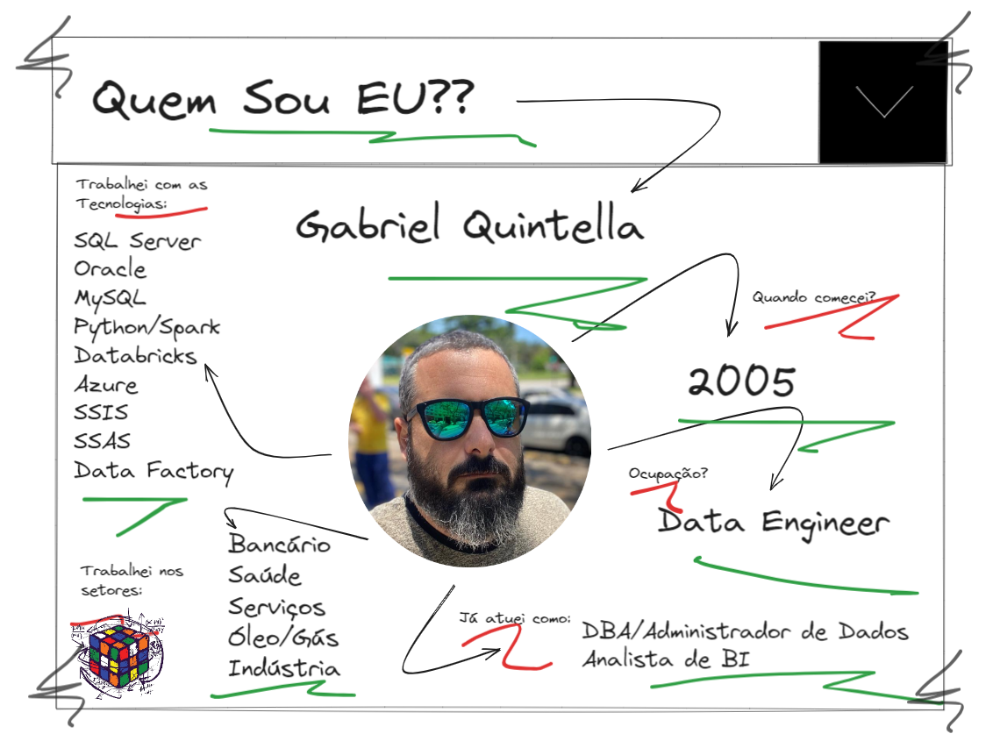

# Projeto BI Zero TO DW

### Quem sou eu?

Meu nome é Gabriel Quintella e você pode me chamar de Quintellão caso queira!

Trabalho com dados desde 2005.

Possuo formação em Sistemas de Informação com especialização em Projetos e Bancos de Dados com foco em BI e Bigdata.

Possuo certicação Itil, Cobit, Microsoft tanto em ambientes OnPrimise e Cloud (Azure), Python e Databricks.

Além disso trabalho atualmente como Engenheiro de Dados porém já atuei como DBA, Administrador de Dados, Programador SQL como foco em Pl/SQL e TSQL, desenvolvedor de BI e como engenheiro de dados.

Possuo experiência em liderança de times de dados e proeficiência em bancos de dados tanto na parte de administração quanto programação, profundos conhecimentos em modelagem de dados relacional e multidimensional.

Quando falamos em ferramentas de integração, trabalehi por muitos anos com Pentaho, SQL Server Integration Service e Data Factory.

E também possuo conhecimento em Python e PySpark.

Deixo minhas redes sociais para poder acompanhar meus trabalhos!

Instagram - https://www.instagram.com/dbaassists/
Twiter - https://twitter.com/dbaassists
YouTube - https://www.youtube.com/@quintellao/featured
Blog - https://www.dbaassists.com.br/
GitHub - https://github.com/dbaassists

Grande abraço e fique com Deus!!

Quintellão

