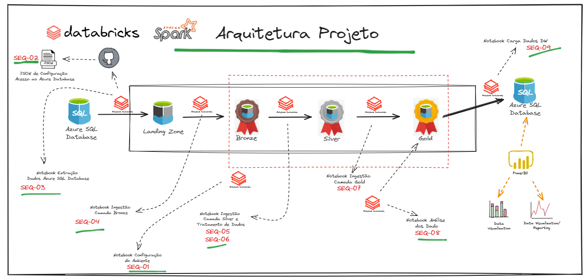

# Projeto BI Zero TO DW

### 1 - Arquitetura do Projeto BI Zero TO DW

Com base no que foi definido na fase de apresentação do projeto, a arquitetura foi definida da seguinte forma.

Objetos criados:

|Sequência|Objeto|Detalhamento
|---|---|---|
| SEQ-01 | Notebook de Configuração do Ambiente | Nesse notebook ficará responsável por conter todos as instruções de criação do armazenamento landing zone no HDFS, criação dos Schemas Bronze, Silver e Gold, assim como a criação das tabelas. Todas os Schemas e Tabelas devem ter a sua definição e também ficará responsável por conter o script de criação da tabela dimensão tempo. |
| SEQ-02 | Arquivo Parâmetro de Conexão com O Azure SQL Database | Estrutura responsável por gerenciar as credenciais de acesso ao banco de dados Azure SQL Database |
| SEQ-03 | Notebook de Extração de Dados do Azure SQL Database | Será responsável por realizar a identificação de quais dados (tabelas) serão exportadas e pertidas na camada landing zone no formato parquet. |
| SEQ-04 | Notebook Ingestão Camada Bronze | Responsável pelo fluxo de leitura da camada landing zone e ingestão dos dados na camada bronze. |
| SEQ-05 | Criação Função Tratamento de Dados | Função que será usada na ingestão dos dados na camada silver e que será usado para aplicar regras de tratamento de dados. |
| SEQ-06 | Notebook Ingestão Camada Silver | Responsável pela ingestão dos dados na camada silver a aplicação de regras de negócio. |
| SEQ-07 | Notebook Ingestão Camada Gold | Responsável pela ingestão dos dados na camada gold no formato de dimensões e fatos. |
| SEQ-08 | Notebook Análise dos Dados | Responsável pela análise dos dados da camada gold. |
| SEQ-09 | Notebook Carga Dados Azure SQL | Responsável por carregar os dados no Azure SQL Database para o schema DW. |
