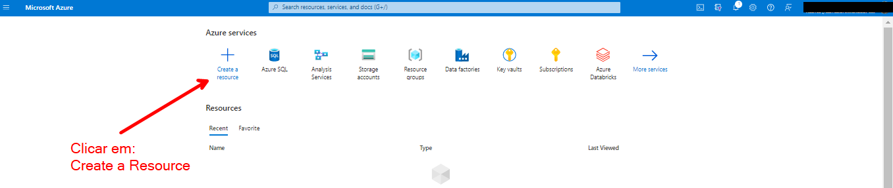
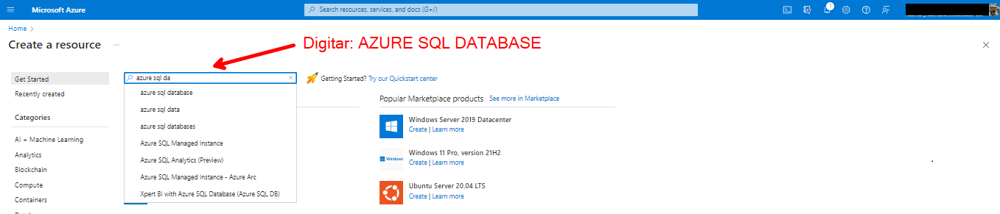
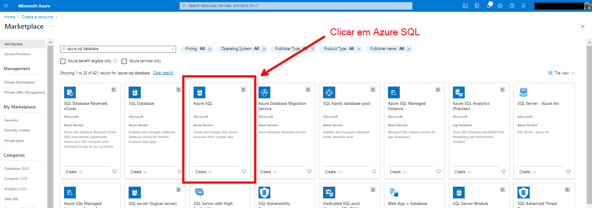
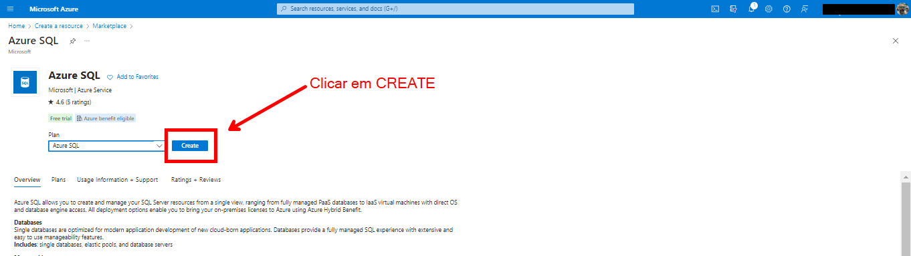
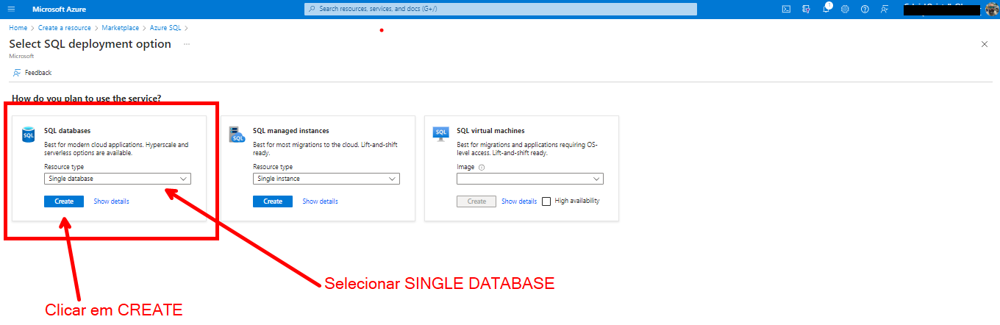
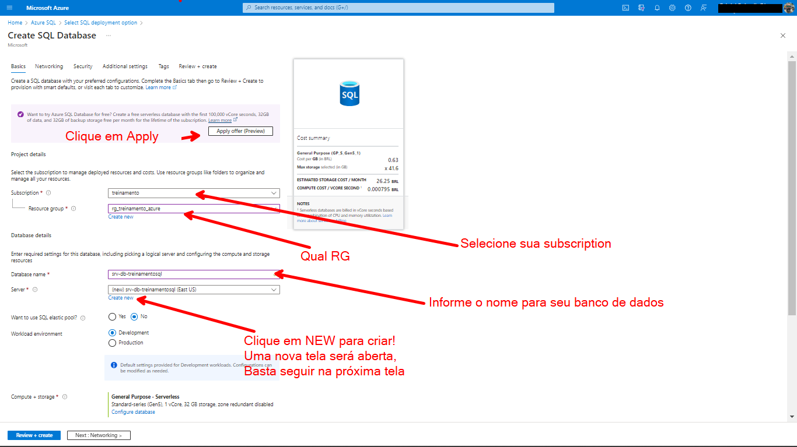
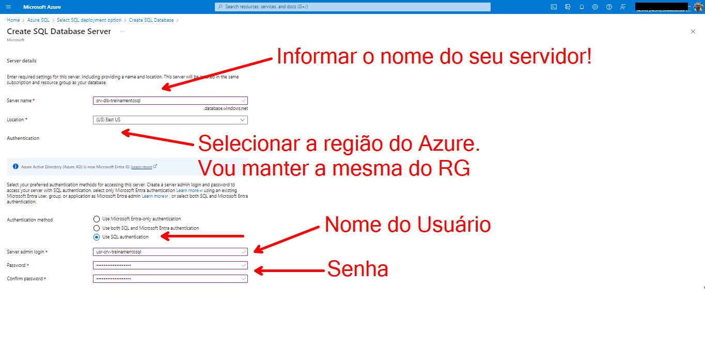
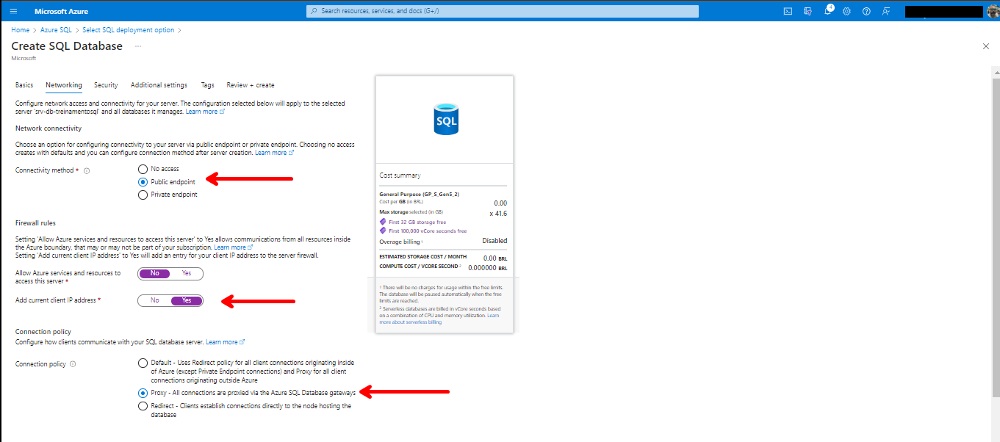
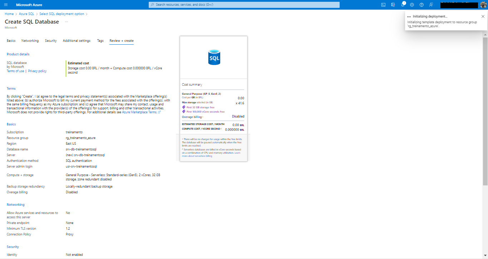

# Projeto BI Zero TO DW

## 2 - Provisionamento do Azure SQL Databese

### 2.1 - Provisionar o Azure SQL Database

Primeiro passo para realizar o provisionamento é você possuir uma conta na Azure e em seguida ter provisionado um Resource Group dentro da sua conta.

O provisionamento do Resource Group não será abordado nesse treinamento, porém deixo um link para você aprender como que é feito.

[Provisionando o Resouce Group](https://www.youtube.com/watch?v=HEJ2r-csrhQ)

Após provisionar o Resource Group, vamos partir para o Azure SQL Server.

Depois de logar em sua conta da Azure, vamos seguir os passos:

Existem diversas formas de provisionar um recurso.

2.1.1 - Clicar em CREATE A RESOURCE

2.1.2 - Vamos procurar o Azure SQL Database. Para isso, na barra SOURCE, vamos digitar AZURE SQL DATABASE.

2.1.3 - Próximo passo é clicar em AZURE SQL.

2.1.4 - Nessa etapa basta clicar em CREATE.

2.1.5 - Por último, selecionar SINGLE DATABASE e depois clicar em CREATE.

### 2.2 - Definindo Nome do Servidor e Banco

Nessa tela, vamos precisar definir as seguintes informações:

* Subscription;
* Resource Group;
* Nome do Servidor (definido na próxima tela);
* Modo de Autenticação (definido na próxima tela);
* Nome do Banco de Dados.

As demais informações na aba Basics vou manter o default.

### 2.3 - Definindo Informações do Servidor

Nessa tela vamos precisar definir as seguintes informações:

* Nome do Servidor;
* Região do Azure;
* Modo de Autenticação;
* Nome do Banco de Dados.

As demais informações na aba Basics vou manter o default.

### 2.4 - Configurações de Rede

Na aba Netwoking segue as configurações:

* 2.4.1 - Em connectivity method: 

    * Public Endpoint

* 2.4.2 - Em firewall rules: 

    * Allow Azure services and resources to access this server - NO
    * Add current client IP address - YES

* 2.4.3 - Em connection policy

    * Proxy

As demais informações na aba Basics vou manter o default.

### 2.5 - Finalizando Provisionamento

Ao clicar em CREATE, o recurso será provisionado.

