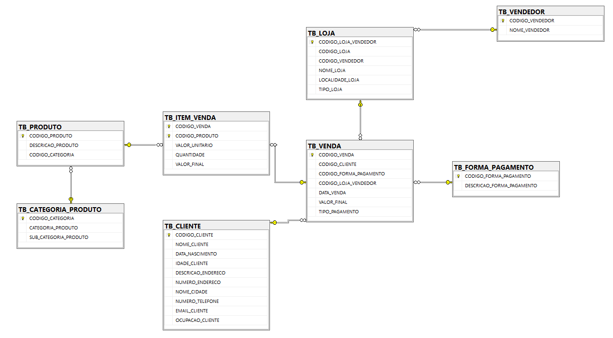

# Projeto BI Zero TO DW

## 3 - Configurando o Ambiente Azure SQL Database

Essa etapa é responsável pela criação das tabelas no banco Azure SQL Database.

### SEQ-3.1 - Tabelas Azure SQL Database.

Pré-Requisito para criação da estrutura do Azure SQL Database.

|Sequência|Ação|Detalhamento
|---|---|---|
|SEQ-2.1|Provisionamento do Azure SQL|Provisionamento de um banco de dados no Azure|

| Banco de Dados | Schema | Tabela | Descrição |
| ------ |  ------ |  ------ |  ------ |
| srv-db-treinamentosql | dbo | TB_FORMA_PAGAMENTO | Armazena informações de forma de pagamento. |
| srv-db-treinamentosql | dbo | TB_CATEGORIA_PRODUTO | Armazena informações das categorias dos produtos |
| srv-db-treinamentosql | dbo | TB_PRODUTO | Armazena informações de produtos. |
| srv-db-treinamentosql | dbo | TB_CLIENTE | Armazena informações de clientes. |
| srv-db-treinamentosql | dbo | TB_VENDEDOR | Armazena informações de vendedores. |
| srv-db-treinamentosql | dbo | TB_LOJA | Armazena informações de lojas. |
| srv-db-treinamentosql | dbo | TB_VENDA | Armazenada informações de vendas. |
| srv-db-treinamentosql | dbo | TB_ITEM_VENDA | Armazena informações sobre os itens que foram vendidos. |

### SEQ-3.2 - Modelo de Dados - Modelagem Relacional

#### 3.2.1 - Diagrama de Dados Gerado no SSMS



#### 3.2.2 - Modelo de Dados Relacional Gerado no Toad Data Modeler


#### 3.2.3 - Modelo de Dados Multidimensional Gerado no Toad Data Modeler

Modelo 01 - Ponto de Debate


Modelo Final


### SEQ-3.3 - Script CREATE TABLE - Baseado no Modeo Relacional

Esse script pode ser encontrado em: [Script de Criação de Tabelas](https://github.com/dbaassists/Projeto_BI_Zero_TO_DW/blob/main/01_SCRIPT_SQL/00_CREATE_TABLE.sql)

``` {.sql title="Script Para Criar Tabelas no SQL" linenums=1}
IF  EXISTS (SELECT * FROM sys.fn_listextendedproperty(N'MS_Description' , N'SCHEMA',N'dbo', N'TABLE',N'Tempo', N'COLUMN',N'DATA_ALTERACAO'))
EXEC sys.sp_dropextendedproperty @name=N'MS_Description' , @level0type=N'SCHEMA',@level0name=N'dbo', @level1type=N'TABLE',@level1name=N'Tempo', @level2type=N'COLUMN',@level2name=N'DATA_ALTERACAO'
GO
IF  EXISTS (SELECT * FROM sys.fn_listextendedproperty(N'MS_Description' , N'SCHEMA',N'dbo', N'TABLE',N'Tempo', N'COLUMN',N'DATA_CADASTRO'))
EXEC sys.sp_dropextendedproperty @name=N'MS_Description' , @level0type=N'SCHEMA',@level0name=N'dbo', @level1type=N'TABLE',@level1name=N'Tempo', @level2type=N'COLUMN',@level2name=N'DATA_CADASTRO'
GO
IF  EXISTS (SELECT * FROM sys.fn_listextendedproperty(N'MS_Description' , N'SCHEMA',N'dbo', N'TABLE',N'Tempo', N'COLUMN',N'DIA'))
EXEC sys.sp_dropextendedproperty @name=N'MS_Description' , @level0type=N'SCHEMA',@level0name=N'dbo', @level1type=N'TABLE',@level1name=N'Tempo', @level2type=N'COLUMN',@level2name=N'DIA'
GO
IF  EXISTS (SELECT * FROM sys.fn_listextendedproperty(N'MS_Description' , N'SCHEMA',N'dbo', N'TABLE',N'Tempo', N'COLUMN',N'MES'))
EXEC sys.sp_dropextendedproperty @name=N'MS_Description' , @level0type=N'SCHEMA',@level0name=N'dbo', @level1type=N'TABLE',@level1name=N'Tempo', @level2type=N'COLUMN',@level2name=N'MES'
GO
IF  EXISTS (SELECT * FROM sys.fn_listextendedproperty(N'MS_Description' , N'SCHEMA',N'dbo', N'TABLE',N'Tempo', N'COLUMN',N'ANO'))
EXEC sys.sp_dropextendedproperty @name=N'MS_Description' , @level0type=N'SCHEMA',@level0name=N'dbo', @level1type=N'TABLE',@level1name=N'Tempo', @level2type=N'COLUMN',@level2name=N'ANO'
GO
IF  EXISTS (SELECT * FROM sys.fn_listextendedproperty(N'MS_Description' , N'SCHEMA',N'dbo', N'TABLE',N'Tempo', N'COLUMN',N'DATA'))
EXEC sys.sp_dropextendedproperty @name=N'MS_Description' , @level0type=N'SCHEMA',@level0name=N'dbo', @level1type=N'TABLE',@level1name=N'Tempo', @level2type=N'COLUMN',@level2name=N'DATA'
GO
IF  EXISTS (SELECT * FROM sys.fn_listextendedproperty(N'MS_Description' , N'SCHEMA',N'dbo', N'TABLE',N'Tempo', N'COLUMN',N'ID_TEMPO'))
EXEC sys.sp_dropextendedproperty @name=N'MS_Description' , @level0type=N'SCHEMA',@level0name=N'dbo', @level1type=N'TABLE',@level1name=N'Tempo', @level2type=N'COLUMN',@level2name=N'ID_TEMPO'
GO
IF  EXISTS (SELECT * FROM sys.fn_listextendedproperty(N'MS_Description' , N'SCHEMA',N'dbo', N'TABLE',N'TB_VENDEDOR', NULL,NULL))
EXEC sys.sp_dropextendedproperty @name=N'MS_Description' , @level0type=N'SCHEMA',@level0name=N'dbo', @level1type=N'TABLE',@level1name=N'TB_VENDEDOR'
GO
IF  EXISTS (SELECT * FROM sys.fn_listextendedproperty(N'MS_Description' , N'SCHEMA',N'dbo', N'TABLE',N'TB_VENDEDOR', N'COLUMN',N'NOME_VENDEDOR'))
EXEC sys.sp_dropextendedproperty @name=N'MS_Description' , @level0type=N'SCHEMA',@level0name=N'dbo', @level1type=N'TABLE',@level1name=N'TB_VENDEDOR', @level2type=N'COLUMN',@level2name=N'NOME_VENDEDOR'
GO
IF  EXISTS (SELECT * FROM sys.fn_listextendedproperty(N'MS_Description' , N'SCHEMA',N'dbo', N'TABLE',N'TB_VENDEDOR', N'COLUMN',N'CODIGO_VENDEDOR'))
EXEC sys.sp_dropextendedproperty @name=N'MS_Description' , @level0type=N'SCHEMA',@level0name=N'dbo', @level1type=N'TABLE',@level1name=N'TB_VENDEDOR', @level2type=N'COLUMN',@level2name=N'CODIGO_VENDEDOR'
GO
IF  EXISTS (SELECT * FROM sys.fn_listextendedproperty(N'MS_Description' , N'SCHEMA',N'dbo', N'TABLE',N'TB_VENDA', NULL,NULL))
EXEC sys.sp_dropextendedproperty @name=N'MS_Description' , @level0type=N'SCHEMA',@level0name=N'dbo', @level1type=N'TABLE',@level1name=N'TB_VENDA'
GO
IF  EXISTS (SELECT * FROM sys.fn_listextendedproperty(N'MS_Description' , N'SCHEMA',N'dbo', N'TABLE',N'TB_VENDA', N'COLUMN',N'TIPO_PAGAMENTO'))
EXEC sys.sp_dropextendedproperty @name=N'MS_Description' , @level0type=N'SCHEMA',@level0name=N'dbo', @level1type=N'TABLE',@level1name=N'TB_VENDA', @level2type=N'COLUMN',@level2name=N'TIPO_PAGAMENTO'
GO
IF  EXISTS (SELECT * FROM sys.fn_listextendedproperty(N'MS_Description' , N'SCHEMA',N'dbo', N'TABLE',N'TB_VENDA', N'COLUMN',N'VALOR_FINAL'))
EXEC sys.sp_dropextendedproperty @name=N'MS_Description' , @level0type=N'SCHEMA',@level0name=N'dbo', @level1type=N'TABLE',@level1name=N'TB_VENDA', @level2type=N'COLUMN',@level2name=N'VALOR_FINAL'
GO
IF  EXISTS (SELECT * FROM sys.fn_listextendedproperty(N'MS_Description' , N'SCHEMA',N'dbo', N'TABLE',N'TB_VENDA', N'COLUMN',N'DATA_VENDA'))
EXEC sys.sp_dropextendedproperty @name=N'MS_Description' , @level0type=N'SCHEMA',@level0name=N'dbo', @level1type=N'TABLE',@level1name=N'TB_VENDA', @level2type=N'COLUMN',@level2name=N'DATA_VENDA'
GO
IF  EXISTS (SELECT * FROM sys.fn_listextendedproperty(N'MS_Description' , N'SCHEMA',N'dbo', N'TABLE',N'TB_VENDA', N'COLUMN',N'CODIGO_FORMA_PAGAMENTO'))
EXEC sys.sp_dropextendedproperty @name=N'MS_Description' , @level0type=N'SCHEMA',@level0name=N'dbo', @level1type=N'TABLE',@level1name=N'TB_VENDA', @level2type=N'COLUMN',@level2name=N'CODIGO_FORMA_PAGAMENTO'
GO
IF  EXISTS (SELECT * FROM sys.fn_listextendedproperty(N'MS_Description' , N'SCHEMA',N'dbo', N'TABLE',N'TB_VENDA', N'COLUMN',N'CODIGO_CLIENTE'))
EXEC sys.sp_dropextendedproperty @name=N'MS_Description' , @level0type=N'SCHEMA',@level0name=N'dbo', @level1type=N'TABLE',@level1name=N'TB_VENDA', @level2type=N'COLUMN',@level2name=N'CODIGO_CLIENTE'
GO
IF  EXISTS (SELECT * FROM sys.fn_listextendedproperty(N'MS_Description' , N'SCHEMA',N'dbo', N'TABLE',N'TB_VENDA', N'COLUMN',N'CODIGO_VENDA'))
EXEC sys.sp_dropextendedproperty @name=N'MS_Description' , @level0type=N'SCHEMA',@level0name=N'dbo', @level1type=N'TABLE',@level1name=N'TB_VENDA', @level2type=N'COLUMN',@level2name=N'CODIGO_VENDA'
GO
IF  EXISTS (SELECT * FROM sys.fn_listextendedproperty(N'MS_Description' , N'SCHEMA',N'dbo', N'TABLE',N'TB_PRODUTO', NULL,NULL))
EXEC sys.sp_dropextendedproperty @name=N'MS_Description' , @level0type=N'SCHEMA',@level0name=N'dbo', @level1type=N'TABLE',@level1name=N'TB_PRODUTO'
GO
IF  EXISTS (SELECT * FROM sys.fn_listextendedproperty(N'MS_Description' , N'SCHEMA',N'dbo', N'TABLE',N'TB_PRODUTO', N'COLUMN',N'CODIGO_CATEGORIA'))
EXEC sys.sp_dropextendedproperty @name=N'MS_Description' , @level0type=N'SCHEMA',@level0name=N'dbo', @level1type=N'TABLE',@level1name=N'TB_PRODUTO', @level2type=N'COLUMN',@level2name=N'CODIGO_CATEGORIA'
GO
IF  EXISTS (SELECT * FROM sys.fn_listextendedproperty(N'MS_Description' , N'SCHEMA',N'dbo', N'TABLE',N'TB_PRODUTO', N'COLUMN',N'DESCRICAO_PRODUTO'))
EXEC sys.sp_dropextendedproperty @name=N'MS_Description' , @level0type=N'SCHEMA',@level0name=N'dbo', @level1type=N'TABLE',@level1name=N'TB_PRODUTO', @level2type=N'COLUMN',@level2name=N'DESCRICAO_PRODUTO'
GO
IF  EXISTS (SELECT * FROM sys.fn_listextendedproperty(N'MS_Description' , N'SCHEMA',N'dbo', N'TABLE',N'TB_PRODUTO', N'COLUMN',N'CODIGO_PRODUTO'))
EXEC sys.sp_dropextendedproperty @name=N'MS_Description' , @level0type=N'SCHEMA',@level0name=N'dbo', @level1type=N'TABLE',@level1name=N'TB_PRODUTO', @level2type=N'COLUMN',@level2name=N'CODIGO_PRODUTO'
GO
IF  EXISTS (SELECT * FROM sys.fn_listextendedproperty(N'MS_Description' , N'SCHEMA',N'dbo', N'TABLE',N'TB_LOJA', NULL,NULL))
EXEC sys.sp_dropextendedproperty @name=N'MS_Description' , @level0type=N'SCHEMA',@level0name=N'dbo', @level1type=N'TABLE',@level1name=N'TB_LOJA'
GO
IF  EXISTS (SELECT * FROM sys.fn_listextendedproperty(N'MS_Description' , N'SCHEMA',N'dbo', N'TABLE',N'TB_LOJA', N'COLUMN',N'TIPO_LOJA'))
EXEC sys.sp_dropextendedproperty @name=N'MS_Description' , @level0type=N'SCHEMA',@level0name=N'dbo', @level1type=N'TABLE',@level1name=N'TB_LOJA', @level2type=N'COLUMN',@level2name=N'TIPO_LOJA'
GO
IF  EXISTS (SELECT * FROM sys.fn_listextendedproperty(N'MS_Description' , N'SCHEMA',N'dbo', N'TABLE',N'TB_LOJA', N'COLUMN',N'LOCALIDADE_LOJA'))
EXEC sys.sp_dropextendedproperty @name=N'MS_Description' , @level0type=N'SCHEMA',@level0name=N'dbo', @level1type=N'TABLE',@level1name=N'TB_LOJA', @level2type=N'COLUMN',@level2name=N'LOCALIDADE_LOJA'
GO
IF  EXISTS (SELECT * FROM sys.fn_listextendedproperty(N'MS_Description' , N'SCHEMA',N'dbo', N'TABLE',N'TB_LOJA', N'COLUMN',N'NOME_LOJA'))
EXEC sys.sp_dropextendedproperty @name=N'MS_Description' , @level0type=N'SCHEMA',@level0name=N'dbo', @level1type=N'TABLE',@level1name=N'TB_LOJA', @level2type=N'COLUMN',@level2name=N'NOME_LOJA'
GO
IF  EXISTS (SELECT * FROM sys.fn_listextendedproperty(N'MS_Description' , N'SCHEMA',N'dbo', N'TABLE',N'TB_LOJA', N'COLUMN',N'CODIGO_LOJA'))
EXEC sys.sp_dropextendedproperty @name=N'MS_Description' , @level0type=N'SCHEMA',@level0name=N'dbo', @level1type=N'TABLE',@level1name=N'TB_LOJA', @level2type=N'COLUMN',@level2name=N'CODIGO_LOJA'
GO
IF  EXISTS (SELECT * FROM sys.fn_listextendedproperty(N'MS_Description' , N'SCHEMA',N'dbo', N'TABLE',N'TB_ITEM_VENDA', NULL,NULL))
EXEC sys.sp_dropextendedproperty @name=N'MS_Description' , @level0type=N'SCHEMA',@level0name=N'dbo', @level1type=N'TABLE',@level1name=N'TB_ITEM_VENDA'
GO
IF  EXISTS (SELECT * FROM sys.fn_listextendedproperty(N'MS_Description' , N'SCHEMA',N'dbo', N'TABLE',N'TB_ITEM_VENDA', N'COLUMN',N'VALOR_FINAL'))
EXEC sys.sp_dropextendedproperty @name=N'MS_Description' , @level0type=N'SCHEMA',@level0name=N'dbo', @level1type=N'TABLE',@level1name=N'TB_ITEM_VENDA', @level2type=N'COLUMN',@level2name=N'VALOR_FINAL'
GO
IF  EXISTS (SELECT * FROM sys.fn_listextendedproperty(N'MS_Description' , N'SCHEMA',N'dbo', N'TABLE',N'TB_ITEM_VENDA', N'COLUMN',N'QUANTIDADE'))
EXEC sys.sp_dropextendedproperty @name=N'MS_Description' , @level0type=N'SCHEMA',@level0name=N'dbo', @level1type=N'TABLE',@level1name=N'TB_ITEM_VENDA', @level2type=N'COLUMN',@level2name=N'QUANTIDADE'
GO
IF  EXISTS (SELECT * FROM sys.fn_listextendedproperty(N'MS_Description' , N'SCHEMA',N'dbo', N'TABLE',N'TB_ITEM_VENDA', N'COLUMN',N'VALOR_UNITARIO'))
EXEC sys.sp_dropextendedproperty @name=N'MS_Description' , @level0type=N'SCHEMA',@level0name=N'dbo', @level1type=N'TABLE',@level1name=N'TB_ITEM_VENDA', @level2type=N'COLUMN',@level2name=N'VALOR_UNITARIO'
GO
IF  EXISTS (SELECT * FROM sys.fn_listextendedproperty(N'MS_Description' , N'SCHEMA',N'dbo', N'TABLE',N'TB_ITEM_VENDA', N'COLUMN',N'CODIGO_PRODUTO'))
EXEC sys.sp_dropextendedproperty @name=N'MS_Description' , @level0type=N'SCHEMA',@level0name=N'dbo', @level1type=N'TABLE',@level1name=N'TB_ITEM_VENDA', @level2type=N'COLUMN',@level2name=N'CODIGO_PRODUTO'
GO
IF  EXISTS (SELECT * FROM sys.fn_listextendedproperty(N'MS_Description' , N'SCHEMA',N'dbo', N'TABLE',N'TB_ITEM_VENDA', N'COLUMN',N'CODIGO_VENDA'))
EXEC sys.sp_dropextendedproperty @name=N'MS_Description' , @level0type=N'SCHEMA',@level0name=N'dbo', @level1type=N'TABLE',@level1name=N'TB_ITEM_VENDA', @level2type=N'COLUMN',@level2name=N'CODIGO_VENDA'
GO
IF  EXISTS (SELECT * FROM sys.fn_listextendedproperty(N'MS_Description' , N'SCHEMA',N'dbo', N'TABLE',N'TB_FORMA_PAGAMENTO', NULL,NULL))
EXEC sys.sp_dropextendedproperty @name=N'MS_Description' , @level0type=N'SCHEMA',@level0name=N'dbo', @level1type=N'TABLE',@level1name=N'TB_FORMA_PAGAMENTO'
GO
IF  EXISTS (SELECT * FROM sys.fn_listextendedproperty(N'MS_Description' , N'SCHEMA',N'dbo', N'TABLE',N'TB_FORMA_PAGAMENTO', N'COLUMN',N'DESCRICAO_FORMA_PAGAMENTO'))
EXEC sys.sp_dropextendedproperty @name=N'MS_Description' , @level0type=N'SCHEMA',@level0name=N'dbo', @level1type=N'TABLE',@level1name=N'TB_FORMA_PAGAMENTO', @level2type=N'COLUMN',@level2name=N'DESCRICAO_FORMA_PAGAMENTO'
GO
IF  EXISTS (SELECT * FROM sys.fn_listextendedproperty(N'MS_Description' , N'SCHEMA',N'dbo', N'TABLE',N'TB_FORMA_PAGAMENTO', N'COLUMN',N'CODIGO_FORMA_PAGAMENTO'))
EXEC sys.sp_dropextendedproperty @name=N'MS_Description' , @level0type=N'SCHEMA',@level0name=N'dbo', @level1type=N'TABLE',@level1name=N'TB_FORMA_PAGAMENTO', @level2type=N'COLUMN',@level2name=N'CODIGO_FORMA_PAGAMENTO'
GO
IF  EXISTS (SELECT * FROM sys.fn_listextendedproperty(N'MS_Description' , N'SCHEMA',N'dbo', N'TABLE',N'TB_CLIENTE', NULL,NULL))
EXEC sys.sp_dropextendedproperty @name=N'MS_Description' , @level0type=N'SCHEMA',@level0name=N'dbo', @level1type=N'TABLE',@level1name=N'TB_CLIENTE'
GO
IF  EXISTS (SELECT * FROM sys.fn_listextendedproperty(N'MS_Description' , N'SCHEMA',N'dbo', N'TABLE',N'TB_CLIENTE', N'COLUMN',N'OCUPACAO_CLIENTE'))
EXEC sys.sp_dropextendedproperty @name=N'MS_Description' , @level0type=N'SCHEMA',@level0name=N'dbo', @level1type=N'TABLE',@level1name=N'TB_CLIENTE', @level2type=N'COLUMN',@level2name=N'OCUPACAO_CLIENTE'
GO
IF  EXISTS (SELECT * FROM sys.fn_listextendedproperty(N'MS_Description' , N'SCHEMA',N'dbo', N'TABLE',N'TB_CLIENTE', N'COLUMN',N'EMAIL_CLIENTE'))
EXEC sys.sp_dropextendedproperty @name=N'MS_Description' , @level0type=N'SCHEMA',@level0name=N'dbo', @level1type=N'TABLE',@level1name=N'TB_CLIENTE', @level2type=N'COLUMN',@level2name=N'EMAIL_CLIENTE'
GO
IF  EXISTS (SELECT * FROM sys.fn_listextendedproperty(N'MS_Description' , N'SCHEMA',N'dbo', N'TABLE',N'TB_CLIENTE', N'COLUMN',N'NUMERO_TELEFONE'))
EXEC sys.sp_dropextendedproperty @name=N'MS_Description' , @level0type=N'SCHEMA',@level0name=N'dbo', @level1type=N'TABLE',@level1name=N'TB_CLIENTE', @level2type=N'COLUMN',@level2name=N'NUMERO_TELEFONE'
GO
IF  EXISTS (SELECT * FROM sys.fn_listextendedproperty(N'MS_Description' , N'SCHEMA',N'dbo', N'TABLE',N'TB_CLIENTE', N'COLUMN',N'NOME_CIDADE'))
EXEC sys.sp_dropextendedproperty @name=N'MS_Description' , @level0type=N'SCHEMA',@level0name=N'dbo', @level1type=N'TABLE',@level1name=N'TB_CLIENTE', @level2type=N'COLUMN',@level2name=N'NOME_CIDADE'
GO
IF  EXISTS (SELECT * FROM sys.fn_listextendedproperty(N'MS_Description' , N'SCHEMA',N'dbo', N'TABLE',N'TB_CLIENTE', N'COLUMN',N'NUMERO_ENDERECO'))
EXEC sys.sp_dropextendedproperty @name=N'MS_Description' , @level0type=N'SCHEMA',@level0name=N'dbo', @level1type=N'TABLE',@level1name=N'TB_CLIENTE', @level2type=N'COLUMN',@level2name=N'NUMERO_ENDERECO'
GO
IF  EXISTS (SELECT * FROM sys.fn_listextendedproperty(N'MS_Description' , N'SCHEMA',N'dbo', N'TABLE',N'TB_CLIENTE', N'COLUMN',N'DESCRICAO_ENDERECO'))
EXEC sys.sp_dropextendedproperty @name=N'MS_Description' , @level0type=N'SCHEMA',@level0name=N'dbo', @level1type=N'TABLE',@level1name=N'TB_CLIENTE', @level2type=N'COLUMN',@level2name=N'DESCRICAO_ENDERECO'
GO
IF  EXISTS (SELECT * FROM sys.fn_listextendedproperty(N'MS_Description' , N'SCHEMA',N'dbo', N'TABLE',N'TB_CLIENTE', N'COLUMN',N'IDADE_CLIENTE'))
EXEC sys.sp_dropextendedproperty @name=N'MS_Description' , @level0type=N'SCHEMA',@level0name=N'dbo', @level1type=N'TABLE',@level1name=N'TB_CLIENTE', @level2type=N'COLUMN',@level2name=N'IDADE_CLIENTE'
GO
IF  EXISTS (SELECT * FROM sys.fn_listextendedproperty(N'MS_Description' , N'SCHEMA',N'dbo', N'TABLE',N'TB_CLIENTE', N'COLUMN',N'DATA_NASCIMENTO'))
EXEC sys.sp_dropextendedproperty @name=N'MS_Description' , @level0type=N'SCHEMA',@level0name=N'dbo', @level1type=N'TABLE',@level1name=N'TB_CLIENTE', @level2type=N'COLUMN',@level2name=N'DATA_NASCIMENTO'
GO
IF  EXISTS (SELECT * FROM sys.fn_listextendedproperty(N'MS_Description' , N'SCHEMA',N'dbo', N'TABLE',N'TB_CLIENTE', N'COLUMN',N'NOME_CLIENTE'))
EXEC sys.sp_dropextendedproperty @name=N'MS_Description' , @level0type=N'SCHEMA',@level0name=N'dbo', @level1type=N'TABLE',@level1name=N'TB_CLIENTE', @level2type=N'COLUMN',@level2name=N'NOME_CLIENTE'
GO
IF  EXISTS (SELECT * FROM sys.fn_listextendedproperty(N'MS_Description' , N'SCHEMA',N'dbo', N'TABLE',N'TB_CLIENTE', N'COLUMN',N'CODIGO_CLIENTE'))
EXEC sys.sp_dropextendedproperty @name=N'MS_Description' , @level0type=N'SCHEMA',@level0name=N'dbo', @level1type=N'TABLE',@level1name=N'TB_CLIENTE', @level2type=N'COLUMN',@level2name=N'CODIGO_CLIENTE'
GO
IF  EXISTS (SELECT * FROM sys.fn_listextendedproperty(N'MS_Description' , N'SCHEMA',N'dbo', N'TABLE',N'TB_CATEGORIA_PRODUTO', NULL,NULL))
EXEC sys.sp_dropextendedproperty @name=N'MS_Description' , @level0type=N'SCHEMA',@level0name=N'dbo', @level1type=N'TABLE',@level1name=N'TB_CATEGORIA_PRODUTO'
GO
IF  EXISTS (SELECT * FROM sys.fn_listextendedproperty(N'MS_Description' , N'SCHEMA',N'dbo', N'TABLE',N'TB_CATEGORIA_PRODUTO', N'COLUMN',N'SUB_CATEGORIA_PRODUTO'))
EXEC sys.sp_dropextendedproperty @name=N'MS_Description' , @level0type=N'SCHEMA',@level0name=N'dbo', @level1type=N'TABLE',@level1name=N'TB_CATEGORIA_PRODUTO', @level2type=N'COLUMN',@level2name=N'SUB_CATEGORIA_PRODUTO'
GO
IF  EXISTS (SELECT * FROM sys.fn_listextendedproperty(N'MS_Description' , N'SCHEMA',N'dbo', N'TABLE',N'TB_CATEGORIA_PRODUTO', N'COLUMN',N'CATEGORIA_PRODUTO'))
EXEC sys.sp_dropextendedproperty @name=N'MS_Description' , @level0type=N'SCHEMA',@level0name=N'dbo', @level1type=N'TABLE',@level1name=N'TB_CATEGORIA_PRODUTO', @level2type=N'COLUMN',@level2name=N'CATEGORIA_PRODUTO'
GO
IF  EXISTS (SELECT * FROM sys.fn_listextendedproperty(N'MS_Description' , N'SCHEMA',N'dbo', N'TABLE',N'TB_CATEGORIA_PRODUTO', N'COLUMN',N'CODIGO_CATEGORIA'))
EXEC sys.sp_dropextendedproperty @name=N'MS_Description' , @level0type=N'SCHEMA',@level0name=N'dbo', @level1type=N'TABLE',@level1name=N'TB_CATEGORIA_PRODUTO', @level2type=N'COLUMN',@level2name=N'CODIGO_CATEGORIA'
GO
IF  EXISTS (SELECT * FROM sys.objects WHERE object_id = OBJECT_ID(N'[dbo].[TB_VENDA]') AND type in (N'U'))
ALTER TABLE [dbo].[TB_VENDA] DROP CONSTRAINT IF EXISTS [FK_TB_VENDA_LOJA_VENDEDOR]
GO
IF  EXISTS (SELECT * FROM sys.objects WHERE object_id = OBJECT_ID(N'[dbo].[TB_VENDA]') AND type in (N'U'))
ALTER TABLE [dbo].[TB_VENDA] DROP CONSTRAINT IF EXISTS [FK_TB_VENDA_FORMA_PAGAMENTO]
GO
IF  EXISTS (SELECT * FROM sys.objects WHERE object_id = OBJECT_ID(N'[dbo].[TB_VENDA]') AND type in (N'U'))
ALTER TABLE [dbo].[TB_VENDA] DROP CONSTRAINT IF EXISTS [FK_TB_VENDA_CLIENTE]
GO
IF  EXISTS (SELECT * FROM sys.objects WHERE object_id = OBJECT_ID(N'[dbo].[TB_PRODUTO]') AND type in (N'U'))
ALTER TABLE [dbo].[TB_PRODUTO] DROP CONSTRAINT IF EXISTS [FK_TB_PRODUTO_CATEGORIA_PRODUTO]
GO
IF  EXISTS (SELECT * FROM sys.objects WHERE object_id = OBJECT_ID(N'[dbo].[TB_LOJA]') AND type in (N'U'))
ALTER TABLE [dbo].[TB_LOJA] DROP CONSTRAINT IF EXISTS [FK_TB_VENDEDOR_LOJA]
GO
IF  EXISTS (SELECT * FROM sys.objects WHERE object_id = OBJECT_ID(N'[dbo].[TB_ITEM_VENDA]') AND type in (N'U'))
ALTER TABLE [dbo].[TB_ITEM_VENDA] DROP CONSTRAINT IF EXISTS [FK_TB_VENDA_ITEM_VENDA]
GO
IF  EXISTS (SELECT * FROM sys.objects WHERE object_id = OBJECT_ID(N'[dbo].[TB_ITEM_VENDA]') AND type in (N'U'))
ALTER TABLE [dbo].[TB_ITEM_VENDA] DROP CONSTRAINT IF EXISTS [FK_TB_ITEM_VENDA_PRODUTO]
GO
IF  EXISTS (SELECT * FROM sys.objects WHERE object_id = OBJECT_ID(N'[dbo].[Tempo]') AND type in (N'U'))
ALTER TABLE [dbo].[Tempo] DROP CONSTRAINT IF EXISTS [DF__Tempo__DATA_ALTE__3CFEF876]
GO
IF  EXISTS (SELECT * FROM sys.objects WHERE object_id = OBJECT_ID(N'[dbo].[Tempo]') AND type in (N'U'))
ALTER TABLE [dbo].[Tempo] DROP CONSTRAINT IF EXISTS [DF__Tempo__DATA_CADA__3C0AD43D]
GO
/****** Object:  Index [IX_02]    Script Date: 15/02/2024 08:28:02 ******/
DROP INDEX IF EXISTS [IX_02] ON [dbo].[TB_VENDA]
GO
/****** Object:  Index [IX_01]    Script Date: 15/02/2024 08:28:02 ******/
DROP INDEX IF EXISTS [IX_01] ON [dbo].[TB_VENDA]
GO
/****** Object:  Index [IX_01]    Script Date: 15/02/2024 08:28:02 ******/
DROP INDEX IF EXISTS [IX_01] ON [dbo].[TB_PRODUTO]
GO
/****** Object:  Index [IX_02]    Script Date: 15/02/2024 08:28:02 ******/
DROP INDEX IF EXISTS [IX_02] ON [dbo].[TB_ITEM_VENDA]
GO
/****** Object:  Index [IX_01]    Script Date: 15/02/2024 08:28:02 ******/
DROP INDEX IF EXISTS [IX_01] ON [dbo].[TB_ITEM_VENDA]
GO
/****** Object:  Table [dbo].[Tempo]    Script Date: 15/02/2024 08:28:02 ******/
DROP TABLE IF EXISTS [dbo].[Tempo]
GO
/****** Object:  Table [dbo].[TB_VENDEDOR]    Script Date: 15/02/2024 08:28:02 ******/
DROP TABLE IF EXISTS [dbo].[TB_VENDEDOR]
GO
/****** Object:  Table [dbo].[TB_VENDA]    Script Date: 15/02/2024 08:28:02 ******/
DROP TABLE IF EXISTS [dbo].[TB_VENDA]
GO
/****** Object:  Table [dbo].[TB_PRODUTO]    Script Date: 15/02/2024 08:28:02 ******/
DROP TABLE IF EXISTS [dbo].[TB_PRODUTO]
GO
/****** Object:  Table [dbo].[TB_LOJA]    Script Date: 15/02/2024 08:28:02 ******/
DROP TABLE IF EXISTS [dbo].[TB_LOJA]
GO
/****** Object:  Table [dbo].[TB_ITEM_VENDA]    Script Date: 15/02/2024 08:28:02 ******/
DROP TABLE IF EXISTS [dbo].[TB_ITEM_VENDA]
GO
/****** Object:  Table [dbo].[TB_FORMA_PAGAMENTO]    Script Date: 15/02/2024 08:28:02 ******/
DROP TABLE IF EXISTS [dbo].[TB_FORMA_PAGAMENTO]
GO
/****** Object:  Table [dbo].[TB_CLIENTE]    Script Date: 15/02/2024 08:28:02 ******/
DROP TABLE IF EXISTS [dbo].[TB_CLIENTE]
GO
/****** Object:  Table [dbo].[TB_CATEGORIA_PRODUTO]    Script Date: 15/02/2024 08:28:02 ******/
DROP TABLE IF EXISTS [dbo].[TB_CATEGORIA_PRODUTO]
GO
/****** Object:  Table [dbo].[TB_CATEGORIA_PRODUTO]    Script Date: 15/02/2024 08:28:02 ******/
SET ANSI_NULLS ON
GO
SET QUOTED_IDENTIFIER ON
GO
CREATE TABLE [dbo].[TB_CATEGORIA_PRODUTO](
	[CODIGO_CATEGORIA] [smallint] IDENTITY(1,1) NOT NULL,
	[CATEGORIA_PRODUTO] [varchar](100) NOT NULL,
	[SUB_CATEGORIA_PRODUTO] [varchar](100) NOT NULL,
 CONSTRAINT [PK_TB_CATEGORIA_PRODUTO] PRIMARY KEY CLUSTERED 
(
	[CODIGO_CATEGORIA] ASC
)WITH (PAD_INDEX = OFF, STATISTICS_NORECOMPUTE = OFF, IGNORE_DUP_KEY = OFF, ALLOW_ROW_LOCKS = ON, ALLOW_PAGE_LOCKS = ON, OPTIMIZE_FOR_SEQUENTIAL_KEY = OFF) ON [PRIMARY]
) ON [PRIMARY]
GO
/****** Object:  Table [dbo].[TB_CLIENTE]    Script Date: 15/02/2024 08:28:02 ******/
SET ANSI_NULLS ON
GO
SET QUOTED_IDENTIFIER ON
GO
CREATE TABLE [dbo].[TB_CLIENTE](
	[CODIGO_CLIENTE] [int] IDENTITY(1,1) NOT NULL,
	[NOME_CLIENTE] [varchar](100) NOT NULL,
	[DATA_NASCIMENTO] [date] NOT NULL,
	[IDADE_CLIENTE] [tinyint] NOT NULL,
	[DESCRICAO_ENDERECO] [varchar](200) NOT NULL,
	[NUMERO_ENDERECO] [smallint] NOT NULL,
	[NOME_CIDADE] [varchar](100) NOT NULL,
	[NUMERO_TELEFONE] [varchar](30) NOT NULL,
	[EMAIL_CLIENTE] [varchar](100) NOT NULL,
	[OCUPACAO_CLIENTE] [varchar](100) NOT NULL,
 CONSTRAINT [PK_TB_CLIENTE] PRIMARY KEY CLUSTERED 
(
	[CODIGO_CLIENTE] ASC
)WITH (PAD_INDEX = OFF, STATISTICS_NORECOMPUTE = OFF, IGNORE_DUP_KEY = OFF, ALLOW_ROW_LOCKS = ON, ALLOW_PAGE_LOCKS = ON, OPTIMIZE_FOR_SEQUENTIAL_KEY = OFF) ON [PRIMARY]
) ON [PRIMARY]
GO
/****** Object:  Table [dbo].[TB_FORMA_PAGAMENTO]    Script Date: 15/02/2024 08:28:02 ******/
SET ANSI_NULLS ON
GO
SET QUOTED_IDENTIFIER ON
GO
CREATE TABLE [dbo].[TB_FORMA_PAGAMENTO](
	[CODIGO_FORMA_PAGAMENTO] [smallint] IDENTITY(1,1) NOT NULL,
	[DESCRICAO_FORMA_PAGAMENTO] [varchar](100) NOT NULL,
 CONSTRAINT [PK_TB_FORMA_PAGAMENTO] PRIMARY KEY CLUSTERED 
(
	[CODIGO_FORMA_PAGAMENTO] ASC
)WITH (PAD_INDEX = OFF, STATISTICS_NORECOMPUTE = OFF, IGNORE_DUP_KEY = OFF, ALLOW_ROW_LOCKS = ON, ALLOW_PAGE_LOCKS = ON, OPTIMIZE_FOR_SEQUENTIAL_KEY = OFF) ON [PRIMARY]
) ON [PRIMARY]
GO
/****** Object:  Table [dbo].[TB_ITEM_VENDA]    Script Date: 15/02/2024 08:28:02 ******/
SET ANSI_NULLS ON
GO
SET QUOTED_IDENTIFIER ON
GO
CREATE TABLE [dbo].[TB_ITEM_VENDA](
	[CODIGO_VENDA] [int] NOT NULL,
	[CODIGO_PRODUTO] [smallint] NOT NULL,
	[VALOR_UNITARIO] [decimal](18, 2) NULL,
	[QUANTIDADE] [smallint] NULL,
	[VALOR_FINAL] [decimal](18, 2) NULL,
 CONSTRAINT [PK_TB_ITEM_VENDA] PRIMARY KEY CLUSTERED 
(
	[CODIGO_VENDA] ASC,
	[CODIGO_PRODUTO] ASC
)WITH (PAD_INDEX = OFF, STATISTICS_NORECOMPUTE = OFF, IGNORE_DUP_KEY = OFF, ALLOW_ROW_LOCKS = ON, ALLOW_PAGE_LOCKS = ON, OPTIMIZE_FOR_SEQUENTIAL_KEY = OFF) ON [PRIMARY]
) ON [PRIMARY]
GO
/****** Object:  Table [dbo].[TB_LOJA]    Script Date: 15/02/2024 08:28:02 ******/
SET ANSI_NULLS ON
GO
SET QUOTED_IDENTIFIER ON
GO
CREATE TABLE [dbo].[TB_LOJA](
	[CODIGO_LOJA_VENDEDOR] [smallint] IDENTITY(1,1) NOT NULL,
	[CODIGO_LOJA] [smallint] NOT NULL,
	[CODIGO_VENDEDOR] [smallint] NOT NULL,
	[NOME_LOJA] [varchar](100) NOT NULL,
	[LOCALIDADE_LOJA] [varchar](100) NOT NULL,
	[TIPO_LOJA] [varchar](100) NOT NULL,
 CONSTRAINT [PK_TB_LOJA] PRIMARY KEY CLUSTERED 
(
	[CODIGO_LOJA_VENDEDOR] ASC
)WITH (PAD_INDEX = OFF, STATISTICS_NORECOMPUTE = OFF, IGNORE_DUP_KEY = OFF, ALLOW_ROW_LOCKS = ON, ALLOW_PAGE_LOCKS = ON, OPTIMIZE_FOR_SEQUENTIAL_KEY = OFF) ON [PRIMARY]
) ON [PRIMARY]
GO
/****** Object:  Table [dbo].[TB_PRODUTO]    Script Date: 15/02/2024 08:28:02 ******/
SET ANSI_NULLS ON
GO
SET QUOTED_IDENTIFIER ON
GO
CREATE TABLE [dbo].[TB_PRODUTO](
	[CODIGO_PRODUTO] [smallint] IDENTITY(1,1) NOT NULL,
	[DESCRICAO_PRODUTO] [varchar](100) NOT NULL,
	[CODIGO_CATEGORIA] [smallint] NOT NULL,
 CONSTRAINT [PK_TB_PRODUTO] PRIMARY KEY CLUSTERED 
(
	[CODIGO_PRODUTO] ASC
)WITH (PAD_INDEX = OFF, STATISTICS_NORECOMPUTE = OFF, IGNORE_DUP_KEY = OFF, ALLOW_ROW_LOCKS = ON, ALLOW_PAGE_LOCKS = ON, OPTIMIZE_FOR_SEQUENTIAL_KEY = OFF) ON [PRIMARY]
) ON [PRIMARY]
GO
/****** Object:  Table [dbo].[TB_VENDA]    Script Date: 15/02/2024 08:28:02 ******/
SET ANSI_NULLS ON
GO
SET QUOTED_IDENTIFIER ON
GO
CREATE TABLE [dbo].[TB_VENDA](
	[CODIGO_VENDA] [int] IDENTITY(1,1) NOT NULL,
	[CODIGO_CLIENTE] [int] NOT NULL,
	[CODIGO_FORMA_PAGAMENTO] [smallint] NOT NULL,
	[CODIGO_LOJA_VENDEDOR] [smallint] NOT NULL,
	[DATA_VENDA] [datetime] NOT NULL,
	[VALOR_FINAL] [decimal](18, 2) NOT NULL,
	[TIPO_PAGAMENTO] [varchar](100) NOT NULL,
 CONSTRAINT [PK_TB_VENDA] PRIMARY KEY CLUSTERED 
(
	[CODIGO_VENDA] ASC
)WITH (PAD_INDEX = OFF, STATISTICS_NORECOMPUTE = OFF, IGNORE_DUP_KEY = OFF, ALLOW_ROW_LOCKS = ON, ALLOW_PAGE_LOCKS = ON, OPTIMIZE_FOR_SEQUENTIAL_KEY = OFF) ON [PRIMARY]
) ON [PRIMARY]
GO
/****** Object:  Table [dbo].[TB_VENDEDOR]    Script Date: 15/02/2024 08:28:02 ******/
SET ANSI_NULLS ON
GO
SET QUOTED_IDENTIFIER ON
GO
CREATE TABLE [dbo].[TB_VENDEDOR](
	[CODIGO_VENDEDOR] [smallint] IDENTITY(1,1) NOT NULL,
	[NOME_VENDEDOR] [varchar](100) NOT NULL,
 CONSTRAINT [PK_CODIGO_VENDEDOR] PRIMARY KEY CLUSTERED 
(
	[CODIGO_VENDEDOR] ASC
)WITH (PAD_INDEX = OFF, STATISTICS_NORECOMPUTE = OFF, IGNORE_DUP_KEY = OFF, ALLOW_ROW_LOCKS = ON, ALLOW_PAGE_LOCKS = ON, OPTIMIZE_FOR_SEQUENTIAL_KEY = OFF) ON [PRIMARY]
) ON [PRIMARY]
GO
/****** Object:  Table [dbo].[Tempo]    Script Date: 15/02/2024 08:28:02 ******/
SET ANSI_NULLS ON
GO
SET QUOTED_IDENTIFIER ON
GO
CREATE TABLE [dbo].[Tempo](
	[ID_TEMPO] [varchar](100) NOT NULL,
	[DATA] [varchar](10) NOT NULL,
	[ANO] [int] NOT NULL,
	[MES] [int] NOT NULL,
	[DIA] [int] NOT NULL,
	[DATA_CADASTRO] [datetime] NOT NULL,
	[DATA_ALTERACAO] [datetime] NOT NULL,
 CONSTRAINT [PK_Tempo] PRIMARY KEY CLUSTERED 
(
	[ID_TEMPO] ASC
)WITH (PAD_INDEX = OFF, STATISTICS_NORECOMPUTE = OFF, IGNORE_DUP_KEY = OFF, ALLOW_ROW_LOCKS = ON, ALLOW_PAGE_LOCKS = ON, OPTIMIZE_FOR_SEQUENTIAL_KEY = OFF) ON [PRIMARY]
) ON [PRIMARY]
GO
/****** Object:  Index [IX_01]    Script Date: 15/02/2024 08:28:02 ******/
CREATE NONCLUSTERED INDEX [IX_01] ON [dbo].[TB_ITEM_VENDA]
(
	[CODIGO_VENDA] ASC
)WITH (PAD_INDEX = OFF, STATISTICS_NORECOMPUTE = OFF, SORT_IN_TEMPDB = OFF, DROP_EXISTING = OFF, ONLINE = OFF, ALLOW_ROW_LOCKS = ON, ALLOW_PAGE_LOCKS = ON, OPTIMIZE_FOR_SEQUENTIAL_KEY = OFF) ON [PRIMARY]
GO
/****** Object:  Index [IX_02]    Script Date: 15/02/2024 08:28:02 ******/
CREATE NONCLUSTERED INDEX [IX_02] ON [dbo].[TB_ITEM_VENDA]
(
	[CODIGO_PRODUTO] ASC
)WITH (PAD_INDEX = OFF, STATISTICS_NORECOMPUTE = OFF, SORT_IN_TEMPDB = OFF, DROP_EXISTING = OFF, ONLINE = OFF, ALLOW_ROW_LOCKS = ON, ALLOW_PAGE_LOCKS = ON, OPTIMIZE_FOR_SEQUENTIAL_KEY = OFF) ON [PRIMARY]
GO
/****** Object:  Index [IX_01]    Script Date: 15/02/2024 08:28:02 ******/
CREATE NONCLUSTERED INDEX [IX_01] ON [dbo].[TB_PRODUTO]
(
	[CODIGO_CATEGORIA] ASC
)WITH (PAD_INDEX = OFF, STATISTICS_NORECOMPUTE = OFF, SORT_IN_TEMPDB = OFF, DROP_EXISTING = OFF, ONLINE = OFF, ALLOW_ROW_LOCKS = ON, ALLOW_PAGE_LOCKS = ON, OPTIMIZE_FOR_SEQUENTIAL_KEY = OFF) ON [PRIMARY]
GO
/****** Object:  Index [IX_01]    Script Date: 15/02/2024 08:28:02 ******/
CREATE NONCLUSTERED INDEX [IX_01] ON [dbo].[TB_VENDA]
(
	[CODIGO_CLIENTE] ASC
)WITH (PAD_INDEX = OFF, STATISTICS_NORECOMPUTE = OFF, SORT_IN_TEMPDB = OFF, DROP_EXISTING = OFF, ONLINE = OFF, ALLOW_ROW_LOCKS = ON, ALLOW_PAGE_LOCKS = ON, OPTIMIZE_FOR_SEQUENTIAL_KEY = OFF) ON [PRIMARY]
GO
/****** Object:  Index [IX_02]    Script Date: 15/02/2024 08:28:02 ******/
CREATE NONCLUSTERED INDEX [IX_02] ON [dbo].[TB_VENDA]
(
	[CODIGO_FORMA_PAGAMENTO] ASC
)WITH (PAD_INDEX = OFF, STATISTICS_NORECOMPUTE = OFF, SORT_IN_TEMPDB = OFF, DROP_EXISTING = OFF, ONLINE = OFF, ALLOW_ROW_LOCKS = ON, ALLOW_PAGE_LOCKS = ON, OPTIMIZE_FOR_SEQUENTIAL_KEY = OFF) ON [PRIMARY]
GO
ALTER TABLE [dbo].[Tempo] ADD  DEFAULT (getdate()) FOR [DATA_CADASTRO]
GO
ALTER TABLE [dbo].[Tempo] ADD  DEFAULT (getdate()) FOR [DATA_ALTERACAO]
GO
ALTER TABLE [dbo].[TB_ITEM_VENDA]  WITH CHECK ADD  CONSTRAINT [FK_TB_ITEM_VENDA_PRODUTO] FOREIGN KEY([CODIGO_PRODUTO])
REFERENCES [dbo].[TB_PRODUTO] ([CODIGO_PRODUTO])
GO
ALTER TABLE [dbo].[TB_ITEM_VENDA] CHECK CONSTRAINT [FK_TB_ITEM_VENDA_PRODUTO]
GO
ALTER TABLE [dbo].[TB_ITEM_VENDA]  WITH CHECK ADD  CONSTRAINT [FK_TB_VENDA_ITEM_VENDA] FOREIGN KEY([CODIGO_VENDA])
REFERENCES [dbo].[TB_VENDA] ([CODIGO_VENDA])
GO
ALTER TABLE [dbo].[TB_ITEM_VENDA] CHECK CONSTRAINT [FK_TB_VENDA_ITEM_VENDA]
GO
ALTER TABLE [dbo].[TB_LOJA]  WITH CHECK ADD  CONSTRAINT [FK_TB_VENDEDOR_LOJA] FOREIGN KEY([CODIGO_VENDEDOR])
REFERENCES [dbo].[TB_VENDEDOR] ([CODIGO_VENDEDOR])
GO
ALTER TABLE [dbo].[TB_LOJA] CHECK CONSTRAINT [FK_TB_VENDEDOR_LOJA]
GO
ALTER TABLE [dbo].[TB_PRODUTO]  WITH CHECK ADD  CONSTRAINT [FK_TB_PRODUTO_CATEGORIA_PRODUTO] FOREIGN KEY([CODIGO_CATEGORIA])
REFERENCES [dbo].[TB_CATEGORIA_PRODUTO] ([CODIGO_CATEGORIA])
GO
ALTER TABLE [dbo].[TB_PRODUTO] CHECK CONSTRAINT [FK_TB_PRODUTO_CATEGORIA_PRODUTO]
GO
ALTER TABLE [dbo].[TB_VENDA]  WITH CHECK ADD  CONSTRAINT [FK_TB_VENDA_CLIENTE] FOREIGN KEY([CODIGO_CLIENTE])
REFERENCES [dbo].[TB_CLIENTE] ([CODIGO_CLIENTE])
GO
ALTER TABLE [dbo].[TB_VENDA] CHECK CONSTRAINT [FK_TB_VENDA_CLIENTE]
GO
ALTER TABLE [dbo].[TB_VENDA]  WITH CHECK ADD  CONSTRAINT [FK_TB_VENDA_FORMA_PAGAMENTO] FOREIGN KEY([CODIGO_FORMA_PAGAMENTO])
REFERENCES [dbo].[TB_FORMA_PAGAMENTO] ([CODIGO_FORMA_PAGAMENTO])
GO
ALTER TABLE [dbo].[TB_VENDA] CHECK CONSTRAINT [FK_TB_VENDA_FORMA_PAGAMENTO]
GO
ALTER TABLE [dbo].[TB_VENDA]  WITH CHECK ADD  CONSTRAINT [FK_TB_VENDA_LOJA_VENDEDOR] FOREIGN KEY([CODIGO_LOJA_VENDEDOR])
REFERENCES [dbo].[TB_LOJA] ([CODIGO_LOJA_VENDEDOR])
GO
ALTER TABLE [dbo].[TB_VENDA] CHECK CONSTRAINT [FK_TB_VENDA_LOJA_VENDEDOR]
GO
EXEC sys.sp_addextendedproperty @name=N'MS_Description', @value=N'Código da Categoria do Produto.' , @level0type=N'SCHEMA',@level0name=N'dbo', @level1type=N'TABLE',@level1name=N'TB_CATEGORIA_PRODUTO', @level2type=N'COLUMN',@level2name=N'CODIGO_CATEGORIA'
GO
EXEC sys.sp_addextendedproperty @name=N'MS_Description', @value=N'Descrição da Categoria do Produto.' , @level0type=N'SCHEMA',@level0name=N'dbo', @level1type=N'TABLE',@level1name=N'TB_CATEGORIA_PRODUTO', @level2type=N'COLUMN',@level2name=N'CATEGORIA_PRODUTO'
GO
EXEC sys.sp_addextendedproperty @name=N'MS_Description', @value=N'Descrição da Sub-Categoria do Produto.' , @level0type=N'SCHEMA',@level0name=N'dbo', @level1type=N'TABLE',@level1name=N'TB_CATEGORIA_PRODUTO', @level2type=N'COLUMN',@level2name=N'SUB_CATEGORIA_PRODUTO'
GO
EXEC sys.sp_addextendedproperty @name=N'MS_Description', @value=N'Armazena informações das categorias dos produtos' , @level0type=N'SCHEMA',@level0name=N'dbo', @level1type=N'TABLE',@level1name=N'TB_CATEGORIA_PRODUTO'
GO
EXEC sys.sp_addextendedproperty @name=N'MS_Description', @value=N'Código do Cliente.' , @level0type=N'SCHEMA',@level0name=N'dbo', @level1type=N'TABLE',@level1name=N'TB_CLIENTE', @level2type=N'COLUMN',@level2name=N'CODIGO_CLIENTE'
GO
EXEC sys.sp_addextendedproperty @name=N'MS_Description', @value=N'Nome do Cliente.' , @level0type=N'SCHEMA',@level0name=N'dbo', @level1type=N'TABLE',@level1name=N'TB_CLIENTE', @level2type=N'COLUMN',@level2name=N'NOME_CLIENTE'
GO
EXEC sys.sp_addextendedproperty @name=N'MS_Description', @value=N'Data de Nascimento do Cliente' , @level0type=N'SCHEMA',@level0name=N'dbo', @level1type=N'TABLE',@level1name=N'TB_CLIENTE', @level2type=N'COLUMN',@level2name=N'DATA_NASCIMENTO'
GO
EXEC sys.sp_addextendedproperty @name=N'MS_Description', @value=N'Idade do Cliente' , @level0type=N'SCHEMA',@level0name=N'dbo', @level1type=N'TABLE',@level1name=N'TB_CLIENTE', @level2type=N'COLUMN',@level2name=N'IDADE_CLIENTE'
GO
EXEC sys.sp_addextendedproperty @name=N'MS_Description', @value=N'Endereço do Cliente' , @level0type=N'SCHEMA',@level0name=N'dbo', @level1type=N'TABLE',@level1name=N'TB_CLIENTE', @level2type=N'COLUMN',@level2name=N'DESCRICAO_ENDERECO'
GO
EXEC sys.sp_addextendedproperty @name=N'MS_Description', @value=N'Número do Endereço' , @level0type=N'SCHEMA',@level0name=N'dbo', @level1type=N'TABLE',@level1name=N'TB_CLIENTE', @level2type=N'COLUMN',@level2name=N'NUMERO_ENDERECO'
GO
EXEC sys.sp_addextendedproperty @name=N'MS_Description', @value=N'Cidade' , @level0type=N'SCHEMA',@level0name=N'dbo', @level1type=N'TABLE',@level1name=N'TB_CLIENTE', @level2type=N'COLUMN',@level2name=N'NOME_CIDADE'
GO
EXEC sys.sp_addextendedproperty @name=N'MS_Description', @value=N'Telefone' , @level0type=N'SCHEMA',@level0name=N'dbo', @level1type=N'TABLE',@level1name=N'TB_CLIENTE', @level2type=N'COLUMN',@level2name=N'NUMERO_TELEFONE'
GO
EXEC sys.sp_addextendedproperty @name=N'MS_Description', @value=N'E-mail do cliente' , @level0type=N'SCHEMA',@level0name=N'dbo', @level1type=N'TABLE',@level1name=N'TB_CLIENTE', @level2type=N'COLUMN',@level2name=N'EMAIL_CLIENTE'
GO
EXEC sys.sp_addextendedproperty @name=N'MS_Description', @value=N'Ocupação do Cliente' , @level0type=N'SCHEMA',@level0name=N'dbo', @level1type=N'TABLE',@level1name=N'TB_CLIENTE', @level2type=N'COLUMN',@level2name=N'OCUPACAO_CLIENTE'
GO
EXEC sys.sp_addextendedproperty @name=N'MS_Description', @value=N'Armazena informações de clientes.' , @level0type=N'SCHEMA',@level0name=N'dbo', @level1type=N'TABLE',@level1name=N'TB_CLIENTE'
GO
EXEC sys.sp_addextendedproperty @name=N'MS_Description', @value=N'Código da Forma de Pagamento na Tabela TB_FORMA_PAGAMENTO.' , @level0type=N'SCHEMA',@level0name=N'dbo', @level1type=N'TABLE',@level1name=N'TB_FORMA_PAGAMENTO', @level2type=N'COLUMN',@level2name=N'CODIGO_FORMA_PAGAMENTO'
GO
EXEC sys.sp_addextendedproperty @name=N'MS_Description', @value=N'Descrição da Forma de Pagamento na Tabela TB_FORMA_PAGAMENTO.' , @level0type=N'SCHEMA',@level0name=N'dbo', @level1type=N'TABLE',@level1name=N'TB_FORMA_PAGAMENTO', @level2type=N'COLUMN',@level2name=N'DESCRICAO_FORMA_PAGAMENTO'
GO
EXEC sys.sp_addextendedproperty @name=N'MS_Description', @value=N'Armazena informações de forma de pagamento.' , @level0type=N'SCHEMA',@level0name=N'dbo', @level1type=N'TABLE',@level1name=N'TB_FORMA_PAGAMENTO'
GO
EXEC sys.sp_addextendedproperty @name=N'MS_Description', @value=N'Código da Venda' , @level0type=N'SCHEMA',@level0name=N'dbo', @level1type=N'TABLE',@level1name=N'TB_ITEM_VENDA', @level2type=N'COLUMN',@level2name=N'CODIGO_VENDA'
GO
EXEC sys.sp_addextendedproperty @name=N'MS_Description', @value=N'Código do Produto' , @level0type=N'SCHEMA',@level0name=N'dbo', @level1type=N'TABLE',@level1name=N'TB_ITEM_VENDA', @level2type=N'COLUMN',@level2name=N'CODIGO_PRODUTO'
GO
EXEC sys.sp_addextendedproperty @name=N'MS_Description', @value=N'Valor Unitário do Produto' , @level0type=N'SCHEMA',@level0name=N'dbo', @level1type=N'TABLE',@level1name=N'TB_ITEM_VENDA', @level2type=N'COLUMN',@level2name=N'VALOR_UNITARIO'
GO
EXEC sys.sp_addextendedproperty @name=N'MS_Description', @value=N'Quantidade do Produto Vendido' , @level0type=N'SCHEMA',@level0name=N'dbo', @level1type=N'TABLE',@level1name=N'TB_ITEM_VENDA', @level2type=N'COLUMN',@level2name=N'QUANTIDADE'
GO
EXEC sys.sp_addextendedproperty @name=N'MS_Description', @value=N'Valor Final do Produto Vendido' , @level0type=N'SCHEMA',@level0name=N'dbo', @level1type=N'TABLE',@level1name=N'TB_ITEM_VENDA', @level2type=N'COLUMN',@level2name=N'VALOR_FINAL'
GO
EXEC sys.sp_addextendedproperty @name=N'MS_Description', @value=N'Armazena informações sobre os itens que foram vendidos.' , @level0type=N'SCHEMA',@level0name=N'dbo', @level1type=N'TABLE',@level1name=N'TB_ITEM_VENDA'
GO
EXEC sys.sp_addextendedproperty @name=N'MS_Description', @value=N'Código da Loja.' , @level0type=N'SCHEMA',@level0name=N'dbo', @level1type=N'TABLE',@level1name=N'TB_LOJA', @level2type=N'COLUMN',@level2name=N'CODIGO_LOJA'
GO
EXEC sys.sp_addextendedproperty @name=N'MS_Description', @value=N'Nome da Loja.' , @level0type=N'SCHEMA',@level0name=N'dbo', @level1type=N'TABLE',@level1name=N'TB_LOJA', @level2type=N'COLUMN',@level2name=N'NOME_LOJA'
GO
EXEC sys.sp_addextendedproperty @name=N'MS_Description', @value=N'Localidade da Loja.' , @level0type=N'SCHEMA',@level0name=N'dbo', @level1type=N'TABLE',@level1name=N'TB_LOJA', @level2type=N'COLUMN',@level2name=N'LOCALIDADE_LOJA'
GO
EXEC sys.sp_addextendedproperty @name=N'MS_Description', @value=N'Tipo da Loja.' , @level0type=N'SCHEMA',@level0name=N'dbo', @level1type=N'TABLE',@level1name=N'TB_LOJA', @level2type=N'COLUMN',@level2name=N'TIPO_LOJA'
GO
EXEC sys.sp_addextendedproperty @name=N'MS_Description', @value=N'Armazena informações de lojas.' , @level0type=N'SCHEMA',@level0name=N'dbo', @level1type=N'TABLE',@level1name=N'TB_LOJA'
GO
EXEC sys.sp_addextendedproperty @name=N'MS_Description', @value=N'Código do Produto.' , @level0type=N'SCHEMA',@level0name=N'dbo', @level1type=N'TABLE',@level1name=N'TB_PRODUTO', @level2type=N'COLUMN',@level2name=N'CODIGO_PRODUTO'
GO
EXEC sys.sp_addextendedproperty @name=N'MS_Description', @value=N'Descrição do Produto.' , @level0type=N'SCHEMA',@level0name=N'dbo', @level1type=N'TABLE',@level1name=N'TB_PRODUTO', @level2type=N'COLUMN',@level2name=N'DESCRICAO_PRODUTO'
GO
EXEC sys.sp_addextendedproperty @name=N'MS_Description', @value=N'Categoria do Produto.' , @level0type=N'SCHEMA',@level0name=N'dbo', @level1type=N'TABLE',@level1name=N'TB_PRODUTO', @level2type=N'COLUMN',@level2name=N'CODIGO_CATEGORIA'
GO
EXEC sys.sp_addextendedproperty @name=N'MS_Description', @value=N'Armazena informações de produtos.' , @level0type=N'SCHEMA',@level0name=N'dbo', @level1type=N'TABLE',@level1name=N'TB_PRODUTO'
GO
EXEC sys.sp_addextendedproperty @name=N'MS_Description', @value=N'Código da Venda.' , @level0type=N'SCHEMA',@level0name=N'dbo', @level1type=N'TABLE',@level1name=N'TB_VENDA', @level2type=N'COLUMN',@level2name=N'CODIGO_VENDA'
GO
EXEC sys.sp_addextendedproperty @name=N'MS_Description', @value=N'Código do Cliente' , @level0type=N'SCHEMA',@level0name=N'dbo', @level1type=N'TABLE',@level1name=N'TB_VENDA', @level2type=N'COLUMN',@level2name=N'CODIGO_CLIENTE'
GO
EXEC sys.sp_addextendedproperty @name=N'MS_Description', @value=N'Forma de Pagamento' , @level0type=N'SCHEMA',@level0name=N'dbo', @level1type=N'TABLE',@level1name=N'TB_VENDA', @level2type=N'COLUMN',@level2name=N'CODIGO_FORMA_PAGAMENTO'
GO
EXEC sys.sp_addextendedproperty @name=N'MS_Description', @value=N'Data da Venda' , @level0type=N'SCHEMA',@level0name=N'dbo', @level1type=N'TABLE',@level1name=N'TB_VENDA', @level2type=N'COLUMN',@level2name=N'DATA_VENDA'
GO
EXEC sys.sp_addextendedproperty @name=N'MS_Description', @value=N'Valor Total da Venda' , @level0type=N'SCHEMA',@level0name=N'dbo', @level1type=N'TABLE',@level1name=N'TB_VENDA', @level2type=N'COLUMN',@level2name=N'VALOR_FINAL'
GO
EXEC sys.sp_addextendedproperty @name=N'MS_Description', @value=N'Tipo de Pagamento' , @level0type=N'SCHEMA',@level0name=N'dbo', @level1type=N'TABLE',@level1name=N'TB_VENDA', @level2type=N'COLUMN',@level2name=N'TIPO_PAGAMENTO'
GO
EXEC sys.sp_addextendedproperty @name=N'MS_Description', @value=N'Armazenada informações de vendas.' , @level0type=N'SCHEMA',@level0name=N'dbo', @level1type=N'TABLE',@level1name=N'TB_VENDA'
GO
EXEC sys.sp_addextendedproperty @name=N'MS_Description', @value=N'Código do Vendedor.' , @level0type=N'SCHEMA',@level0name=N'dbo', @level1type=N'TABLE',@level1name=N'TB_VENDEDOR', @level2type=N'COLUMN',@level2name=N'CODIGO_VENDEDOR'
GO
EXEC sys.sp_addextendedproperty @name=N'MS_Description', @value=N'Nome do Vendedor.' , @level0type=N'SCHEMA',@level0name=N'dbo', @level1type=N'TABLE',@level1name=N'TB_VENDEDOR', @level2type=N'COLUMN',@level2name=N'NOME_VENDEDOR'
GO
EXEC sys.sp_addextendedproperty @name=N'MS_Description', @value=N'Armazena informações de vendedores' , @level0type=N'SCHEMA',@level0name=N'dbo', @level1type=N'TABLE',@level1name=N'TB_VENDEDOR'
GO
EXEC sys.sp_addextendedproperty @name=N'MS_Description', @value=N'Chave da Dimensão Tempo' , @level0type=N'SCHEMA',@level0name=N'dbo', @level1type=N'TABLE',@level1name=N'Tempo', @level2type=N'COLUMN',@level2name=N'ID_TEMPO'
GO
EXEC sys.sp_addextendedproperty @name=N'MS_Description', @value=N'Identifica a Data' , @level0type=N'SCHEMA',@level0name=N'dbo', @level1type=N'TABLE',@level1name=N'Tempo', @level2type=N'COLUMN',@level2name=N'DATA'
GO
EXEC sys.sp_addextendedproperty @name=N'MS_Description', @value=N'Ano referente a coluna data.' , @level0type=N'SCHEMA',@level0name=N'dbo', @level1type=N'TABLE',@level1name=N'Tempo', @level2type=N'COLUMN',@level2name=N'ANO'
GO
EXEC sys.sp_addextendedproperty @name=N'MS_Description', @value=N'Mês referente a coluna data.' , @level0type=N'SCHEMA',@level0name=N'dbo', @level1type=N'TABLE',@level1name=N'Tempo', @level2type=N'COLUMN',@level2name=N'MES'
GO
EXEC sys.sp_addextendedproperty @name=N'MS_Description', @value=N'Dia referente a coluna data.' , @level0type=N'SCHEMA',@level0name=N'dbo', @level1type=N'TABLE',@level1name=N'Tempo', @level2type=N'COLUMN',@level2name=N'DIA'
GO
EXEC sys.sp_addextendedproperty @name=N'MS_Description', @value=N'Data de Cadastro do Registro.' , @level0type=N'SCHEMA',@level0name=N'dbo', @level1type=N'TABLE',@level1name=N'Tempo', @level2type=N'COLUMN',@level2name=N'DATA_CADASTRO'
GO
EXEC sys.sp_addextendedproperty @name=N'MS_Description', @value=N'Data de Atualização do Registro.' , @level0type=N'SCHEMA',@level0name=N'dbo', @level1type=N'TABLE',@level1name=N'Tempo', @level2type=N'COLUMN',@level2name=N'DATA_ALTERACAO'
GO
```

### SEQ-3.4 - Script CREATE TABLE - Baseado no Modelo Multidimensional

Esse script pode ser encontrado em: [Script de Criação de Tabelas Fatos e Dimensões](https://github.com/dbaassists/Projeto_BI_Zero_TO_DW/blob/main/01_SCRIPT_SQL/00_CREATE_TABLE_DIMENSIONAL.sql)

``` {.sql title="Script Para Criar Tabelas Fatos e Dimensões no SQL" linenums=1}
IF  EXISTS (SELECT * FROM sys.fn_listextendedproperty(N'MS_Description' , N'SCHEMA',N'dw', N'TABLE',N'Fato_Venda', N'COLUMN',N'DATA_ALTERACAO'))
EXEC sys.sp_dropextendedproperty @name=N'MS_Description' , @level0type=N'SCHEMA',@level0name=N'dw', @level1type=N'TABLE',@level1name=N'Fato_Venda', @level2type=N'COLUMN',@level2name=N'DATA_ALTERACAO'
GO
IF  EXISTS (SELECT * FROM sys.fn_listextendedproperty(N'MS_Description' , N'SCHEMA',N'dw', N'TABLE',N'Fato_Venda', N'COLUMN',N'DATA_CADASTRO'))
EXEC sys.sp_dropextendedproperty @name=N'MS_Description' , @level0type=N'SCHEMA',@level0name=N'dw', @level1type=N'TABLE',@level1name=N'Fato_Venda', @level2type=N'COLUMN',@level2name=N'DATA_CADASTRO'
GO
IF  EXISTS (SELECT * FROM sys.fn_listextendedproperty(N'MS_Description' , N'SCHEMA',N'dw', N'TABLE',N'Fato_Venda', N'COLUMN',N'TIPO_PAGAMENTO'))
EXEC sys.sp_dropextendedproperty @name=N'MS_Description' , @level0type=N'SCHEMA',@level0name=N'dw', @level1type=N'TABLE',@level1name=N'Fato_Venda', @level2type=N'COLUMN',@level2name=N'TIPO_PAGAMENTO'
GO
IF  EXISTS (SELECT * FROM sys.fn_listextendedproperty(N'MS_Description' , N'SCHEMA',N'dw', N'TABLE',N'Fato_Venda', N'COLUMN',N'VALOR_FINAL'))
EXEC sys.sp_dropextendedproperty @name=N'MS_Description' , @level0type=N'SCHEMA',@level0name=N'dw', @level1type=N'TABLE',@level1name=N'Fato_Venda', @level2type=N'COLUMN',@level2name=N'VALOR_FINAL'
GO
IF  EXISTS (SELECT * FROM sys.fn_listextendedproperty(N'MS_Description' , N'SCHEMA',N'dw', N'TABLE',N'Fato_Venda', N'COLUMN',N'VALOR_UNITARIO'))
EXEC sys.sp_dropextendedproperty @name=N'MS_Description' , @level0type=N'SCHEMA',@level0name=N'dw', @level1type=N'TABLE',@level1name=N'Fato_Venda', @level2type=N'COLUMN',@level2name=N'VALOR_UNITARIO'
GO
IF  EXISTS (SELECT * FROM sys.fn_listextendedproperty(N'MS_Description' , N'SCHEMA',N'dw', N'TABLE',N'Fato_Venda', N'COLUMN',N'QUANTIDADE'))
EXEC sys.sp_dropextendedproperty @name=N'MS_Description' , @level0type=N'SCHEMA',@level0name=N'dw', @level1type=N'TABLE',@level1name=N'Fato_Venda', @level2type=N'COLUMN',@level2name=N'QUANTIDADE'
GO
IF  EXISTS (SELECT * FROM sys.fn_listextendedproperty(N'MS_Description' , N'SCHEMA',N'dw', N'TABLE',N'Fato_Venda', N'COLUMN',N'HORA_VENDA'))
EXEC sys.sp_dropextendedproperty @name=N'MS_Description' , @level0type=N'SCHEMA',@level0name=N'dw', @level1type=N'TABLE',@level1name=N'Fato_Venda', @level2type=N'COLUMN',@level2name=N'HORA_VENDA'
GO
IF  EXISTS (SELECT * FROM sys.fn_listextendedproperty(N'MS_Description' , N'SCHEMA',N'dw', N'TABLE',N'Fato_Venda', N'COLUMN',N'ID_TEMPO'))
EXEC sys.sp_dropextendedproperty @name=N'MS_Description' , @level0type=N'SCHEMA',@level0name=N'dw', @level1type=N'TABLE',@level1name=N'Fato_Venda', @level2type=N'COLUMN',@level2name=N'ID_TEMPO'
GO
IF  EXISTS (SELECT * FROM sys.fn_listextendedproperty(N'MS_Description' , N'SCHEMA',N'dw', N'TABLE',N'Fato_Venda', N'COLUMN',N'ID_FORMA_PAGAMENTO'))
EXEC sys.sp_dropextendedproperty @name=N'MS_Description' , @level0type=N'SCHEMA',@level0name=N'dw', @level1type=N'TABLE',@level1name=N'Fato_Venda', @level2type=N'COLUMN',@level2name=N'ID_FORMA_PAGAMENTO'
GO
IF  EXISTS (SELECT * FROM sys.fn_listextendedproperty(N'MS_Description' , N'SCHEMA',N'dw', N'TABLE',N'Fato_Venda', N'COLUMN',N'ID_PRODUTO'))
EXEC sys.sp_dropextendedproperty @name=N'MS_Description' , @level0type=N'SCHEMA',@level0name=N'dw', @level1type=N'TABLE',@level1name=N'Fato_Venda', @level2type=N'COLUMN',@level2name=N'ID_PRODUTO'
GO
IF  EXISTS (SELECT * FROM sys.fn_listextendedproperty(N'MS_Description' , N'SCHEMA',N'dw', N'TABLE',N'Fato_Venda', N'COLUMN',N'ID_LOJA'))
EXEC sys.sp_dropextendedproperty @name=N'MS_Description' , @level0type=N'SCHEMA',@level0name=N'dw', @level1type=N'TABLE',@level1name=N'Fato_Venda', @level2type=N'COLUMN',@level2name=N'ID_LOJA'
GO
IF  EXISTS (SELECT * FROM sys.fn_listextendedproperty(N'MS_Description' , N'SCHEMA',N'dw', N'TABLE',N'Fato_Venda', N'COLUMN',N'ID_CLIENTE'))
EXEC sys.sp_dropextendedproperty @name=N'MS_Description' , @level0type=N'SCHEMA',@level0name=N'dw', @level1type=N'TABLE',@level1name=N'Fato_Venda', @level2type=N'COLUMN',@level2name=N'ID_CLIENTE'
GO
IF  EXISTS (SELECT * FROM sys.fn_listextendedproperty(N'MS_Description' , N'SCHEMA',N'dw', N'TABLE',N'Fato_Venda', N'COLUMN',N'CODIGO_VENDA'))
EXEC sys.sp_dropextendedproperty @name=N'MS_Description' , @level0type=N'SCHEMA',@level0name=N'dw', @level1type=N'TABLE',@level1name=N'Fato_Venda', @level2type=N'COLUMN',@level2name=N'CODIGO_VENDA'
GO
IF  EXISTS (SELECT * FROM sys.fn_listextendedproperty(N'MS_Description' , N'SCHEMA',N'dw', N'TABLE',N'Dim_Tempo', N'COLUMN',N'DATA_ALTERACAO'))
EXEC sys.sp_dropextendedproperty @name=N'MS_Description' , @level0type=N'SCHEMA',@level0name=N'dw', @level1type=N'TABLE',@level1name=N'Dim_Tempo', @level2type=N'COLUMN',@level2name=N'DATA_ALTERACAO'
GO
IF  EXISTS (SELECT * FROM sys.fn_listextendedproperty(N'MS_Description' , N'SCHEMA',N'dw', N'TABLE',N'Dim_Tempo', N'COLUMN',N'DATA_CADASTRO'))
EXEC sys.sp_dropextendedproperty @name=N'MS_Description' , @level0type=N'SCHEMA',@level0name=N'dw', @level1type=N'TABLE',@level1name=N'Dim_Tempo', @level2type=N'COLUMN',@level2name=N'DATA_CADASTRO'
GO
IF  EXISTS (SELECT * FROM sys.fn_listextendedproperty(N'MS_Description' , N'SCHEMA',N'dw', N'TABLE',N'Dim_Tempo', N'COLUMN',N'DIA'))
EXEC sys.sp_dropextendedproperty @name=N'MS_Description' , @level0type=N'SCHEMA',@level0name=N'dw', @level1type=N'TABLE',@level1name=N'Dim_Tempo', @level2type=N'COLUMN',@level2name=N'DIA'
GO
IF  EXISTS (SELECT * FROM sys.fn_listextendedproperty(N'MS_Description' , N'SCHEMA',N'dw', N'TABLE',N'Dim_Tempo', N'COLUMN',N'MES'))
EXEC sys.sp_dropextendedproperty @name=N'MS_Description' , @level0type=N'SCHEMA',@level0name=N'dw', @level1type=N'TABLE',@level1name=N'Dim_Tempo', @level2type=N'COLUMN',@level2name=N'MES'
GO
IF  EXISTS (SELECT * FROM sys.fn_listextendedproperty(N'MS_Description' , N'SCHEMA',N'dw', N'TABLE',N'Dim_Tempo', N'COLUMN',N'ANO'))
EXEC sys.sp_dropextendedproperty @name=N'MS_Description' , @level0type=N'SCHEMA',@level0name=N'dw', @level1type=N'TABLE',@level1name=N'Dim_Tempo', @level2type=N'COLUMN',@level2name=N'ANO'
GO
IF  EXISTS (SELECT * FROM sys.fn_listextendedproperty(N'MS_Description' , N'SCHEMA',N'dw', N'TABLE',N'Dim_Tempo', N'COLUMN',N'DATA'))
EXEC sys.sp_dropextendedproperty @name=N'MS_Description' , @level0type=N'SCHEMA',@level0name=N'dw', @level1type=N'TABLE',@level1name=N'Dim_Tempo', @level2type=N'COLUMN',@level2name=N'DATA'
GO
IF  EXISTS (SELECT * FROM sys.fn_listextendedproperty(N'MS_Description' , N'SCHEMA',N'dw', N'TABLE',N'Dim_Tempo', N'COLUMN',N'ID_TEMPO'))
EXEC sys.sp_dropextendedproperty @name=N'MS_Description' , @level0type=N'SCHEMA',@level0name=N'dw', @level1type=N'TABLE',@level1name=N'Dim_Tempo', @level2type=N'COLUMN',@level2name=N'ID_TEMPO'
GO
IF  EXISTS (SELECT * FROM sys.fn_listextendedproperty(N'MS_Description' , N'SCHEMA',N'dw', N'TABLE',N'Dim_Produto', N'COLUMN',N'DATA_ALTERACAO'))
EXEC sys.sp_dropextendedproperty @name=N'MS_Description' , @level0type=N'SCHEMA',@level0name=N'dw', @level1type=N'TABLE',@level1name=N'Dim_Produto', @level2type=N'COLUMN',@level2name=N'DATA_ALTERACAO'
GO
IF  EXISTS (SELECT * FROM sys.fn_listextendedproperty(N'MS_Description' , N'SCHEMA',N'dw', N'TABLE',N'Dim_Produto', N'COLUMN',N'DATA_CADASTRO'))
EXEC sys.sp_dropextendedproperty @name=N'MS_Description' , @level0type=N'SCHEMA',@level0name=N'dw', @level1type=N'TABLE',@level1name=N'Dim_Produto', @level2type=N'COLUMN',@level2name=N'DATA_CADASTRO'
GO
IF  EXISTS (SELECT * FROM sys.fn_listextendedproperty(N'MS_Description' , N'SCHEMA',N'dw', N'TABLE',N'Dim_Produto', N'COLUMN',N'SUB_CATEGORIA_PRODUTO'))
EXEC sys.sp_dropextendedproperty @name=N'MS_Description' , @level0type=N'SCHEMA',@level0name=N'dw', @level1type=N'TABLE',@level1name=N'Dim_Produto', @level2type=N'COLUMN',@level2name=N'SUB_CATEGORIA_PRODUTO'
GO
IF  EXISTS (SELECT * FROM sys.fn_listextendedproperty(N'MS_Description' , N'SCHEMA',N'dw', N'TABLE',N'Dim_Produto', N'COLUMN',N'CATEGORIA_PRODUTO'))
EXEC sys.sp_dropextendedproperty @name=N'MS_Description' , @level0type=N'SCHEMA',@level0name=N'dw', @level1type=N'TABLE',@level1name=N'Dim_Produto', @level2type=N'COLUMN',@level2name=N'CATEGORIA_PRODUTO'
GO
IF  EXISTS (SELECT * FROM sys.fn_listextendedproperty(N'MS_Description' , N'SCHEMA',N'dw', N'TABLE',N'Dim_Produto', N'COLUMN',N'DESCRICAO_PRODUTO'))
EXEC sys.sp_dropextendedproperty @name=N'MS_Description' , @level0type=N'SCHEMA',@level0name=N'dw', @level1type=N'TABLE',@level1name=N'Dim_Produto', @level2type=N'COLUMN',@level2name=N'DESCRICAO_PRODUTO'
GO
IF  EXISTS (SELECT * FROM sys.fn_listextendedproperty(N'MS_Description' , N'SCHEMA',N'dw', N'TABLE',N'Dim_Produto', N'COLUMN',N'CODIGO_PRODUTO'))
EXEC sys.sp_dropextendedproperty @name=N'MS_Description' , @level0type=N'SCHEMA',@level0name=N'dw', @level1type=N'TABLE',@level1name=N'Dim_Produto', @level2type=N'COLUMN',@level2name=N'CODIGO_PRODUTO'
GO
IF  EXISTS (SELECT * FROM sys.fn_listextendedproperty(N'MS_Description' , N'SCHEMA',N'dw', N'TABLE',N'Dim_Produto', N'COLUMN',N'ID_PRODUTO'))
EXEC sys.sp_dropextendedproperty @name=N'MS_Description' , @level0type=N'SCHEMA',@level0name=N'dw', @level1type=N'TABLE',@level1name=N'Dim_Produto', @level2type=N'COLUMN',@level2name=N'ID_PRODUTO'
GO
IF  EXISTS (SELECT * FROM sys.fn_listextendedproperty(N'MS_Description' , N'SCHEMA',N'dw', N'TABLE',N'Dim_Loja', N'COLUMN',N'DATA_ALTERACAO'))
EXEC sys.sp_dropextendedproperty @name=N'MS_Description' , @level0type=N'SCHEMA',@level0name=N'dw', @level1type=N'TABLE',@level1name=N'Dim_Loja', @level2type=N'COLUMN',@level2name=N'DATA_ALTERACAO'
GO
IF  EXISTS (SELECT * FROM sys.fn_listextendedproperty(N'MS_Description' , N'SCHEMA',N'dw', N'TABLE',N'Dim_Loja', N'COLUMN',N'DATA_CADASTRO'))
EXEC sys.sp_dropextendedproperty @name=N'MS_Description' , @level0type=N'SCHEMA',@level0name=N'dw', @level1type=N'TABLE',@level1name=N'Dim_Loja', @level2type=N'COLUMN',@level2name=N'DATA_CADASTRO'
GO
IF  EXISTS (SELECT * FROM sys.fn_listextendedproperty(N'MS_Description' , N'SCHEMA',N'dw', N'TABLE',N'Dim_Loja', N'COLUMN',N'TIPO_LOJA'))
EXEC sys.sp_dropextendedproperty @name=N'MS_Description' , @level0type=N'SCHEMA',@level0name=N'dw', @level1type=N'TABLE',@level1name=N'Dim_Loja', @level2type=N'COLUMN',@level2name=N'TIPO_LOJA'
GO
IF  EXISTS (SELECT * FROM sys.fn_listextendedproperty(N'MS_Description' , N'SCHEMA',N'dw', N'TABLE',N'Dim_Loja', N'COLUMN',N'LOCALIDADE_LOJA'))
EXEC sys.sp_dropextendedproperty @name=N'MS_Description' , @level0type=N'SCHEMA',@level0name=N'dw', @level1type=N'TABLE',@level1name=N'Dim_Loja', @level2type=N'COLUMN',@level2name=N'LOCALIDADE_LOJA'
GO
IF  EXISTS (SELECT * FROM sys.fn_listextendedproperty(N'MS_Description' , N'SCHEMA',N'dw', N'TABLE',N'Dim_Loja', N'COLUMN',N'NOME_VENDEDOR'))
EXEC sys.sp_dropextendedproperty @name=N'MS_Description' , @level0type=N'SCHEMA',@level0name=N'dw', @level1type=N'TABLE',@level1name=N'Dim_Loja', @level2type=N'COLUMN',@level2name=N'NOME_VENDEDOR'
GO
IF  EXISTS (SELECT * FROM sys.fn_listextendedproperty(N'MS_Description' , N'SCHEMA',N'dw', N'TABLE',N'Dim_Loja', N'COLUMN',N'NOME_LOJA'))
EXEC sys.sp_dropextendedproperty @name=N'MS_Description' , @level0type=N'SCHEMA',@level0name=N'dw', @level1type=N'TABLE',@level1name=N'Dim_Loja', @level2type=N'COLUMN',@level2name=N'NOME_LOJA'
GO
IF  EXISTS (SELECT * FROM sys.fn_listextendedproperty(N'MS_Description' , N'SCHEMA',N'dw', N'TABLE',N'Dim_Loja', N'COLUMN',N'CODIGO_LOJA'))
EXEC sys.sp_dropextendedproperty @name=N'MS_Description' , @level0type=N'SCHEMA',@level0name=N'dw', @level1type=N'TABLE',@level1name=N'Dim_Loja', @level2type=N'COLUMN',@level2name=N'CODIGO_LOJA'
GO
IF  EXISTS (SELECT * FROM sys.fn_listextendedproperty(N'MS_Description' , N'SCHEMA',N'dw', N'TABLE',N'Dim_Loja', N'COLUMN',N'ID_LOJA'))
EXEC sys.sp_dropextendedproperty @name=N'MS_Description' , @level0type=N'SCHEMA',@level0name=N'dw', @level1type=N'TABLE',@level1name=N'Dim_Loja', @level2type=N'COLUMN',@level2name=N'ID_LOJA'
GO
IF  EXISTS (SELECT * FROM sys.fn_listextendedproperty(N'MS_Description' , N'SCHEMA',N'dw', N'TABLE',N'Dim_Forma_Pagamento', N'COLUMN',N'DATA_ALTERACAO'))
EXEC sys.sp_dropextendedproperty @name=N'MS_Description' , @level0type=N'SCHEMA',@level0name=N'dw', @level1type=N'TABLE',@level1name=N'Dim_Forma_Pagamento', @level2type=N'COLUMN',@level2name=N'DATA_ALTERACAO'
GO
IF  EXISTS (SELECT * FROM sys.fn_listextendedproperty(N'MS_Description' , N'SCHEMA',N'dw', N'TABLE',N'Dim_Forma_Pagamento', N'COLUMN',N'DATA_CADASTRO'))
EXEC sys.sp_dropextendedproperty @name=N'MS_Description' , @level0type=N'SCHEMA',@level0name=N'dw', @level1type=N'TABLE',@level1name=N'Dim_Forma_Pagamento', @level2type=N'COLUMN',@level2name=N'DATA_CADASTRO'
GO
IF  EXISTS (SELECT * FROM sys.fn_listextendedproperty(N'MS_Description' , N'SCHEMA',N'dw', N'TABLE',N'Dim_Forma_Pagamento', N'COLUMN',N'DESCRICAO_FORMA_PAGAMENTO'))
EXEC sys.sp_dropextendedproperty @name=N'MS_Description' , @level0type=N'SCHEMA',@level0name=N'dw', @level1type=N'TABLE',@level1name=N'Dim_Forma_Pagamento', @level2type=N'COLUMN',@level2name=N'DESCRICAO_FORMA_PAGAMENTO'
GO
IF  EXISTS (SELECT * FROM sys.fn_listextendedproperty(N'MS_Description' , N'SCHEMA',N'dw', N'TABLE',N'Dim_Forma_Pagamento', N'COLUMN',N'CODIGO_FORMA_PAGAMENTO'))
EXEC sys.sp_dropextendedproperty @name=N'MS_Description' , @level0type=N'SCHEMA',@level0name=N'dw', @level1type=N'TABLE',@level1name=N'Dim_Forma_Pagamento', @level2type=N'COLUMN',@level2name=N'CODIGO_FORMA_PAGAMENTO'
GO
IF  EXISTS (SELECT * FROM sys.fn_listextendedproperty(N'MS_Description' , N'SCHEMA',N'dw', N'TABLE',N'Dim_Forma_Pagamento', N'COLUMN',N'ID_FORMA_PAGAMENTO'))
EXEC sys.sp_dropextendedproperty @name=N'MS_Description' , @level0type=N'SCHEMA',@level0name=N'dw', @level1type=N'TABLE',@level1name=N'Dim_Forma_Pagamento', @level2type=N'COLUMN',@level2name=N'ID_FORMA_PAGAMENTO'
GO
IF  EXISTS (SELECT * FROM sys.fn_listextendedproperty(N'MS_Description' , N'SCHEMA',N'dw', N'TABLE',N'Dim_Cliente', N'COLUMN',N'DATA_ALTERACAO'))
EXEC sys.sp_dropextendedproperty @name=N'MS_Description' , @level0type=N'SCHEMA',@level0name=N'dw', @level1type=N'TABLE',@level1name=N'Dim_Cliente', @level2type=N'COLUMN',@level2name=N'DATA_ALTERACAO'
GO
IF  EXISTS (SELECT * FROM sys.fn_listextendedproperty(N'MS_Description' , N'SCHEMA',N'dw', N'TABLE',N'Dim_Cliente', N'COLUMN',N'DATA_CADASTRO'))
EXEC sys.sp_dropextendedproperty @name=N'MS_Description' , @level0type=N'SCHEMA',@level0name=N'dw', @level1type=N'TABLE',@level1name=N'Dim_Cliente', @level2type=N'COLUMN',@level2name=N'DATA_CADASTRO'
GO
IF  EXISTS (SELECT * FROM sys.fn_listextendedproperty(N'MS_Description' , N'SCHEMA',N'dw', N'TABLE',N'Dim_Cliente', N'COLUMN',N'OCUPACAO_CLIENTE'))
EXEC sys.sp_dropextendedproperty @name=N'MS_Description' , @level0type=N'SCHEMA',@level0name=N'dw', @level1type=N'TABLE',@level1name=N'Dim_Cliente', @level2type=N'COLUMN',@level2name=N'OCUPACAO_CLIENTE'
GO
IF  EXISTS (SELECT * FROM sys.fn_listextendedproperty(N'MS_Description' , N'SCHEMA',N'dw', N'TABLE',N'Dim_Cliente', N'COLUMN',N'EMAIL_CLIENTE'))
EXEC sys.sp_dropextendedproperty @name=N'MS_Description' , @level0type=N'SCHEMA',@level0name=N'dw', @level1type=N'TABLE',@level1name=N'Dim_Cliente', @level2type=N'COLUMN',@level2name=N'EMAIL_CLIENTE'
GO
IF  EXISTS (SELECT * FROM sys.fn_listextendedproperty(N'MS_Description' , N'SCHEMA',N'dw', N'TABLE',N'Dim_Cliente', N'COLUMN',N'NUMERO_TELEFONE'))
EXEC sys.sp_dropextendedproperty @name=N'MS_Description' , @level0type=N'SCHEMA',@level0name=N'dw', @level1type=N'TABLE',@level1name=N'Dim_Cliente', @level2type=N'COLUMN',@level2name=N'NUMERO_TELEFONE'
GO
IF  EXISTS (SELECT * FROM sys.fn_listextendedproperty(N'MS_Description' , N'SCHEMA',N'dw', N'TABLE',N'Dim_Cliente', N'COLUMN',N'NOME_CIDADE'))
EXEC sys.sp_dropextendedproperty @name=N'MS_Description' , @level0type=N'SCHEMA',@level0name=N'dw', @level1type=N'TABLE',@level1name=N'Dim_Cliente', @level2type=N'COLUMN',@level2name=N'NOME_CIDADE'
GO
IF  EXISTS (SELECT * FROM sys.fn_listextendedproperty(N'MS_Description' , N'SCHEMA',N'dw', N'TABLE',N'Dim_Cliente', N'COLUMN',N'NUMERO_ENDERECO'))
EXEC sys.sp_dropextendedproperty @name=N'MS_Description' , @level0type=N'SCHEMA',@level0name=N'dw', @level1type=N'TABLE',@level1name=N'Dim_Cliente', @level2type=N'COLUMN',@level2name=N'NUMERO_ENDERECO'
GO
IF  EXISTS (SELECT * FROM sys.fn_listextendedproperty(N'MS_Description' , N'SCHEMA',N'dw', N'TABLE',N'Dim_Cliente', N'COLUMN',N'DESCRICAO_ENDERECO'))
EXEC sys.sp_dropextendedproperty @name=N'MS_Description' , @level0type=N'SCHEMA',@level0name=N'dw', @level1type=N'TABLE',@level1name=N'Dim_Cliente', @level2type=N'COLUMN',@level2name=N'DESCRICAO_ENDERECO'
GO
IF  EXISTS (SELECT * FROM sys.fn_listextendedproperty(N'MS_Description' , N'SCHEMA',N'dw', N'TABLE',N'Dim_Cliente', N'COLUMN',N'IDADE_CLIENTE'))
EXEC sys.sp_dropextendedproperty @name=N'MS_Description' , @level0type=N'SCHEMA',@level0name=N'dw', @level1type=N'TABLE',@level1name=N'Dim_Cliente', @level2type=N'COLUMN',@level2name=N'IDADE_CLIENTE'
GO
IF  EXISTS (SELECT * FROM sys.fn_listextendedproperty(N'MS_Description' , N'SCHEMA',N'dw', N'TABLE',N'Dim_Cliente', N'COLUMN',N'DATA_NASCIMENTO'))
EXEC sys.sp_dropextendedproperty @name=N'MS_Description' , @level0type=N'SCHEMA',@level0name=N'dw', @level1type=N'TABLE',@level1name=N'Dim_Cliente', @level2type=N'COLUMN',@level2name=N'DATA_NASCIMENTO'
GO
IF  EXISTS (SELECT * FROM sys.fn_listextendedproperty(N'MS_Description' , N'SCHEMA',N'dw', N'TABLE',N'Dim_Cliente', N'COLUMN',N'NOME_CLIENTE'))
EXEC sys.sp_dropextendedproperty @name=N'MS_Description' , @level0type=N'SCHEMA',@level0name=N'dw', @level1type=N'TABLE',@level1name=N'Dim_Cliente', @level2type=N'COLUMN',@level2name=N'NOME_CLIENTE'
GO
IF  EXISTS (SELECT * FROM sys.fn_listextendedproperty(N'MS_Description' , N'SCHEMA',N'dw', N'TABLE',N'Dim_Cliente', N'COLUMN',N'CODIGO_CLIENTE'))
EXEC sys.sp_dropextendedproperty @name=N'MS_Description' , @level0type=N'SCHEMA',@level0name=N'dw', @level1type=N'TABLE',@level1name=N'Dim_Cliente', @level2type=N'COLUMN',@level2name=N'CODIGO_CLIENTE'
GO
IF  EXISTS (SELECT * FROM sys.fn_listextendedproperty(N'MS_Description' , N'SCHEMA',N'dw', N'TABLE',N'Dim_Cliente', N'COLUMN',N'ID_CLIENTE'))
EXEC sys.sp_dropextendedproperty @name=N'MS_Description' , @level0type=N'SCHEMA',@level0name=N'dw', @level1type=N'TABLE',@level1name=N'Dim_Cliente', @level2type=N'COLUMN',@level2name=N'ID_CLIENTE'
GO
IF  EXISTS (SELECT * FROM sys.fn_listextendedproperty(N'MS_Description' , N'SCHEMA',N'dbo', N'TABLE',N'Tempo', N'COLUMN',N'DATA_ALTERACAO'))
EXEC sys.sp_dropextendedproperty @name=N'MS_Description' , @level0type=N'SCHEMA',@level0name=N'dbo', @level1type=N'TABLE',@level1name=N'Tempo', @level2type=N'COLUMN',@level2name=N'DATA_ALTERACAO'
GO
IF  EXISTS (SELECT * FROM sys.fn_listextendedproperty(N'MS_Description' , N'SCHEMA',N'dbo', N'TABLE',N'Tempo', N'COLUMN',N'DATA_CADASTRO'))
EXEC sys.sp_dropextendedproperty @name=N'MS_Description' , @level0type=N'SCHEMA',@level0name=N'dbo', @level1type=N'TABLE',@level1name=N'Tempo', @level2type=N'COLUMN',@level2name=N'DATA_CADASTRO'
GO
IF  EXISTS (SELECT * FROM sys.fn_listextendedproperty(N'MS_Description' , N'SCHEMA',N'dbo', N'TABLE',N'Tempo', N'COLUMN',N'DIA'))
EXEC sys.sp_dropextendedproperty @name=N'MS_Description' , @level0type=N'SCHEMA',@level0name=N'dbo', @level1type=N'TABLE',@level1name=N'Tempo', @level2type=N'COLUMN',@level2name=N'DIA'
GO
IF  EXISTS (SELECT * FROM sys.fn_listextendedproperty(N'MS_Description' , N'SCHEMA',N'dbo', N'TABLE',N'Tempo', N'COLUMN',N'MES'))
EXEC sys.sp_dropextendedproperty @name=N'MS_Description' , @level0type=N'SCHEMA',@level0name=N'dbo', @level1type=N'TABLE',@level1name=N'Tempo', @level2type=N'COLUMN',@level2name=N'MES'
GO
IF  EXISTS (SELECT * FROM sys.fn_listextendedproperty(N'MS_Description' , N'SCHEMA',N'dbo', N'TABLE',N'Tempo', N'COLUMN',N'ANO'))
EXEC sys.sp_dropextendedproperty @name=N'MS_Description' , @level0type=N'SCHEMA',@level0name=N'dbo', @level1type=N'TABLE',@level1name=N'Tempo', @level2type=N'COLUMN',@level2name=N'ANO'
GO
IF  EXISTS (SELECT * FROM sys.fn_listextendedproperty(N'MS_Description' , N'SCHEMA',N'dbo', N'TABLE',N'Tempo', N'COLUMN',N'DATA'))
EXEC sys.sp_dropextendedproperty @name=N'MS_Description' , @level0type=N'SCHEMA',@level0name=N'dbo', @level1type=N'TABLE',@level1name=N'Tempo', @level2type=N'COLUMN',@level2name=N'DATA'
GO
IF  EXISTS (SELECT * FROM sys.fn_listextendedproperty(N'MS_Description' , N'SCHEMA',N'dbo', N'TABLE',N'Tempo', N'COLUMN',N'ID_TEMPO'))
EXEC sys.sp_dropextendedproperty @name=N'MS_Description' , @level0type=N'SCHEMA',@level0name=N'dbo', @level1type=N'TABLE',@level1name=N'Tempo', @level2type=N'COLUMN',@level2name=N'ID_TEMPO'
GO
IF  EXISTS (SELECT * FROM sys.objects WHERE object_id = OBJECT_ID(N'[dw].[Fato_Venda]') AND type in (N'U'))
ALTER TABLE [dw].[Fato_Venda] DROP CONSTRAINT IF EXISTS [FK_Fato_Venda_Dim_Tempo]
GO
IF  EXISTS (SELECT * FROM sys.objects WHERE object_id = OBJECT_ID(N'[dw].[Fato_Venda]') AND type in (N'U'))
ALTER TABLE [dw].[Fato_Venda] DROP CONSTRAINT IF EXISTS [FK_Fato_Venda_Dim_Produto]
GO
IF  EXISTS (SELECT * FROM sys.objects WHERE object_id = OBJECT_ID(N'[dw].[Fato_Venda]') AND type in (N'U'))
ALTER TABLE [dw].[Fato_Venda] DROP CONSTRAINT IF EXISTS [FK_Fato_Venda_Dim_loja]
GO
IF  EXISTS (SELECT * FROM sys.objects WHERE object_id = OBJECT_ID(N'[dw].[Fato_Venda]') AND type in (N'U'))
ALTER TABLE [dw].[Fato_Venda] DROP CONSTRAINT IF EXISTS [FK_Fato_Venda_Dim_Forma_Pagamento]
GO
IF  EXISTS (SELECT * FROM sys.objects WHERE object_id = OBJECT_ID(N'[dw].[Fato_Venda]') AND type in (N'U'))
ALTER TABLE [dw].[Fato_Venda] DROP CONSTRAINT IF EXISTS [FK_Fato_Venda_Dim_Cliente]
GO
IF  EXISTS (SELECT * FROM sys.objects WHERE object_id = OBJECT_ID(N'[dw].[Fato_Venda]') AND type in (N'U'))
ALTER TABLE [dw].[Fato_Venda] DROP CONSTRAINT IF EXISTS [DF__Fato_Vend__DATA___2803DB90]
GO
IF  EXISTS (SELECT * FROM sys.objects WHERE object_id = OBJECT_ID(N'[dw].[Fato_Venda]') AND type in (N'U'))
ALTER TABLE [dw].[Fato_Venda] DROP CONSTRAINT IF EXISTS [DF__Fato_Vend__DATA___270FB757]
GO
IF  EXISTS (SELECT * FROM sys.objects WHERE object_id = OBJECT_ID(N'[dw].[Dim_Tempo]') AND type in (N'U'))
ALTER TABLE [dw].[Dim_Tempo] DROP CONSTRAINT IF EXISTS [DF__Dim_Tempo__DATA___24334AAC]
GO
IF  EXISTS (SELECT * FROM sys.objects WHERE object_id = OBJECT_ID(N'[dw].[Dim_Tempo]') AND type in (N'U'))
ALTER TABLE [dw].[Dim_Tempo] DROP CONSTRAINT IF EXISTS [DF__Dim_Tempo__DATA___233F2673]
GO
IF  EXISTS (SELECT * FROM sys.objects WHERE object_id = OBJECT_ID(N'[dw].[Dim_Produto]') AND type in (N'U'))
ALTER TABLE [dw].[Dim_Produto] DROP CONSTRAINT IF EXISTS [DF__Dim_Produ__DATA___2062B9C8]
GO
IF  EXISTS (SELECT * FROM sys.objects WHERE object_id = OBJECT_ID(N'[dw].[Dim_Produto]') AND type in (N'U'))
ALTER TABLE [dw].[Dim_Produto] DROP CONSTRAINT IF EXISTS [DF__Dim_Produ__DATA___1F6E958F]
GO
IF  EXISTS (SELECT * FROM sys.objects WHERE object_id = OBJECT_ID(N'[dw].[Dim_Loja]') AND type in (N'U'))
ALTER TABLE [dw].[Dim_Loja] DROP CONSTRAINT IF EXISTS [DF__Dim_Loja__DATA_A__1C9228E4]
GO
IF  EXISTS (SELECT * FROM sys.objects WHERE object_id = OBJECT_ID(N'[dw].[Dim_Loja]') AND type in (N'U'))
ALTER TABLE [dw].[Dim_Loja] DROP CONSTRAINT IF EXISTS [DF__Dim_Loja__DATA_C__1B9E04AB]
GO
IF  EXISTS (SELECT * FROM sys.objects WHERE object_id = OBJECT_ID(N'[dw].[Dim_Forma_Pagamento]') AND type in (N'U'))
ALTER TABLE [dw].[Dim_Forma_Pagamento] DROP CONSTRAINT IF EXISTS [DF__Dim_Forma__DATA___18C19800]
GO
IF  EXISTS (SELECT * FROM sys.objects WHERE object_id = OBJECT_ID(N'[dw].[Dim_Forma_Pagamento]') AND type in (N'U'))
ALTER TABLE [dw].[Dim_Forma_Pagamento] DROP CONSTRAINT IF EXISTS [DF__Dim_Forma__DATA___17CD73C7]
GO
IF  EXISTS (SELECT * FROM sys.objects WHERE object_id = OBJECT_ID(N'[dw].[Dim_Cliente]') AND type in (N'U'))
ALTER TABLE [dw].[Dim_Cliente] DROP CONSTRAINT IF EXISTS [DF__Dim_Clien__DATA___14F1071C]
GO
IF  EXISTS (SELECT * FROM sys.objects WHERE object_id = OBJECT_ID(N'[dw].[Dim_Cliente]') AND type in (N'U'))
ALTER TABLE [dw].[Dim_Cliente] DROP CONSTRAINT IF EXISTS [DF__Dim_Clien__DATA___13FCE2E3]
GO
IF  EXISTS (SELECT * FROM sys.objects WHERE object_id = OBJECT_ID(N'[dbo].[Tempo]') AND type in (N'U'))
ALTER TABLE [dbo].[Tempo] DROP CONSTRAINT IF EXISTS [DF__Tempo__DATA_ALTE__3CFEF876]
GO
IF  EXISTS (SELECT * FROM sys.objects WHERE object_id = OBJECT_ID(N'[dbo].[Tempo]') AND type in (N'U'))
ALTER TABLE [dbo].[Tempo] DROP CONSTRAINT IF EXISTS [DF__Tempo__DATA_CADA__3C0AD43D]
GO
/****** Object:  Table [dw].[Fato_Venda]    Script Date: 15/02/2024 08:31:43 ******/
DROP TABLE IF EXISTS [dw].[Fato_Venda]
GO
/****** Object:  Table [dw].[Dim_Tempo]    Script Date: 15/02/2024 08:31:43 ******/
DROP TABLE IF EXISTS [dw].[Dim_Tempo]
GO
/****** Object:  Table [dw].[Dim_Produto]    Script Date: 15/02/2024 08:31:43 ******/
DROP TABLE IF EXISTS [dw].[Dim_Produto]
GO
/****** Object:  Table [dw].[Dim_Loja]    Script Date: 15/02/2024 08:31:43 ******/
DROP TABLE IF EXISTS [dw].[Dim_Loja]
GO
/****** Object:  Table [dw].[Dim_Forma_Pagamento]    Script Date: 15/02/2024 08:31:43 ******/
DROP TABLE IF EXISTS [dw].[Dim_Forma_Pagamento]
GO
/****** Object:  Table [dw].[Dim_Cliente]    Script Date: 15/02/2024 08:31:43 ******/
DROP TABLE IF EXISTS [dw].[Dim_Cliente]
GO
/****** Object:  Table [dbo].[Tempo]    Script Date: 15/02/2024 08:31:43 ******/
DROP TABLE IF EXISTS [dbo].[Tempo]
GO
/****** Object:  Table [dbo].[Tempo]    Script Date: 15/02/2024 08:31:43 ******/
SET ANSI_NULLS ON
GO
SET QUOTED_IDENTIFIER ON
GO
CREATE TABLE [dbo].[Tempo](
	[ID_TEMPO] [varchar](100) NOT NULL,
	[DATA] [varchar](10) NOT NULL,
	[ANO] [int] NOT NULL,
	[MES] [int] NOT NULL,
	[DIA] [int] NOT NULL,
	[DATA_CADASTRO] [datetime] NOT NULL,
	[DATA_ALTERACAO] [datetime] NOT NULL,
 CONSTRAINT [PK_Tempo] PRIMARY KEY CLUSTERED 
(
	[ID_TEMPO] ASC
)WITH (PAD_INDEX = OFF, STATISTICS_NORECOMPUTE = OFF, IGNORE_DUP_KEY = OFF, ALLOW_ROW_LOCKS = ON, ALLOW_PAGE_LOCKS = ON, OPTIMIZE_FOR_SEQUENTIAL_KEY = OFF) ON [PRIMARY]
) ON [PRIMARY]
GO
/****** Object:  Table [dw].[Dim_Cliente]    Script Date: 15/02/2024 08:31:43 ******/
SET ANSI_NULLS ON
GO
SET QUOTED_IDENTIFIER ON
GO
CREATE TABLE [dw].[Dim_Cliente](
	[ID_CLIENTE] [varchar](100) NOT NULL,
	[CODIGO_CLIENTE] [int] NOT NULL,
	[NOME_CLIENTE] [varchar](100) NOT NULL,
	[DATA_NASCIMENTO] [date] NOT NULL,
	[IDADE_CLIENTE] [int] NOT NULL,
	[DESCRICAO_ENDERECO] [varchar](200) NOT NULL,
	[NUMERO_ENDERECO] [int] NOT NULL,
	[NOME_CIDADE] [varchar](100) NOT NULL,
	[NUMERO_TELEFONE] [varchar](30) NOT NULL,
	[EMAIL_CLIENTE] [varchar](100) NOT NULL,
	[OCUPACAO_CLIENTE] [varchar](100) NOT NULL,
	[DATA_CADASTRO] [datetime] NOT NULL,
	[DATA_ALTERACAO] [datetime] NOT NULL,
 CONSTRAINT [PK_Dim_Cliente] PRIMARY KEY CLUSTERED 
(
	[ID_CLIENTE] ASC
)WITH (PAD_INDEX = OFF, STATISTICS_NORECOMPUTE = OFF, IGNORE_DUP_KEY = OFF, ALLOW_ROW_LOCKS = ON, ALLOW_PAGE_LOCKS = ON, OPTIMIZE_FOR_SEQUENTIAL_KEY = OFF) ON [PRIMARY]
) ON [PRIMARY]
GO
/****** Object:  Table [dw].[Dim_Forma_Pagamento]    Script Date: 15/02/2024 08:31:43 ******/
SET ANSI_NULLS ON
GO
SET QUOTED_IDENTIFIER ON
GO
CREATE TABLE [dw].[Dim_Forma_Pagamento](
	[ID_FORMA_PAGAMENTO] [varchar](100) NOT NULL,
	[CODIGO_FORMA_PAGAMENTO] [int] NOT NULL,
	[DESCRICAO_FORMA_PAGAMENTO] [varchar](100) NOT NULL,
	[DATA_CADASTRO] [datetime] NOT NULL,
	[DATA_ALTERACAO] [datetime] NOT NULL,
 CONSTRAINT [PK_Dim_Forma_Pagamento] PRIMARY KEY CLUSTERED 
(
	[ID_FORMA_PAGAMENTO] ASC
)WITH (PAD_INDEX = OFF, STATISTICS_NORECOMPUTE = OFF, IGNORE_DUP_KEY = OFF, ALLOW_ROW_LOCKS = ON, ALLOW_PAGE_LOCKS = ON, OPTIMIZE_FOR_SEQUENTIAL_KEY = OFF) ON [PRIMARY]
) ON [PRIMARY]
GO
/****** Object:  Table [dw].[Dim_Loja]    Script Date: 15/02/2024 08:31:43 ******/
SET ANSI_NULLS ON
GO
SET QUOTED_IDENTIFIER ON
GO
CREATE TABLE [dw].[Dim_Loja](
	[ID_LOJA] [varchar](100) NOT NULL,
	[CODIGO_LOJA] [int] NOT NULL,
	[NOME_LOJA] [varchar](100) NOT NULL,
	[NOME_VENDEDOR] [varchar](100) NOT NULL,
	[LOCALIDADE_LOJA] [varchar](100) NOT NULL,
	[TIPO_LOJA] [varchar](100) NOT NULL,
	[DATA_CADASTRO] [datetime] NOT NULL,
	[DATA_ALTERACAO] [datetime] NOT NULL,
 CONSTRAINT [PK_Dim_Loja] PRIMARY KEY CLUSTERED 
(
	[ID_LOJA] ASC
)WITH (PAD_INDEX = OFF, STATISTICS_NORECOMPUTE = OFF, IGNORE_DUP_KEY = OFF, ALLOW_ROW_LOCKS = ON, ALLOW_PAGE_LOCKS = ON, OPTIMIZE_FOR_SEQUENTIAL_KEY = OFF) ON [PRIMARY]
) ON [PRIMARY]
GO
/****** Object:  Table [dw].[Dim_Produto]    Script Date: 15/02/2024 08:31:43 ******/
SET ANSI_NULLS ON
GO
SET QUOTED_IDENTIFIER ON
GO
CREATE TABLE [dw].[Dim_Produto](
	[ID_PRODUTO] [varchar](100) NOT NULL,
	[CODIGO_PRODUTO] [int] NOT NULL,
	[DESCRICAO_PRODUTO] [varchar](100) NOT NULL,
	[CATEGORIA_PRODUTO] [varchar](100) NOT NULL,
	[SUB_CATEGORIA_PRODUTO] [varchar](100) NOT NULL,
	[DATA_CADASTRO] [datetime] NOT NULL,
	[DATA_ALTERACAO] [datetime] NOT NULL,
 CONSTRAINT [PK_Dim_Produto] PRIMARY KEY CLUSTERED 
(
	[ID_PRODUTO] ASC
)WITH (PAD_INDEX = OFF, STATISTICS_NORECOMPUTE = OFF, IGNORE_DUP_KEY = OFF, ALLOW_ROW_LOCKS = ON, ALLOW_PAGE_LOCKS = ON, OPTIMIZE_FOR_SEQUENTIAL_KEY = OFF) ON [PRIMARY]
) ON [PRIMARY]
GO
/****** Object:  Table [dw].[Dim_Tempo]    Script Date: 15/02/2024 08:31:43 ******/
SET ANSI_NULLS ON
GO
SET QUOTED_IDENTIFIER ON
GO
CREATE TABLE [dw].[Dim_Tempo](
	[ID_TEMPO] [varchar](100) NOT NULL,
	[DATA] [varchar](10) NOT NULL,
	[ANO] [int] NOT NULL,
	[MES] [int] NOT NULL,
	[DIA] [int] NOT NULL,
	[DATA_CADASTRO] [datetime] NOT NULL,
	[DATA_ALTERACAO] [datetime] NOT NULL,
 CONSTRAINT [PK_Dim_Tempo] PRIMARY KEY CLUSTERED 
(
	[ID_TEMPO] ASC
)WITH (PAD_INDEX = OFF, STATISTICS_NORECOMPUTE = OFF, IGNORE_DUP_KEY = OFF, ALLOW_ROW_LOCKS = ON, ALLOW_PAGE_LOCKS = ON, OPTIMIZE_FOR_SEQUENTIAL_KEY = OFF) ON [PRIMARY]
) ON [PRIMARY]
GO
/****** Object:  Table [dw].[Fato_Venda]    Script Date: 15/02/2024 08:31:43 ******/
SET ANSI_NULLS ON
GO
SET QUOTED_IDENTIFIER ON
GO
CREATE TABLE [dw].[Fato_Venda](
	[CODIGO_VENDA] [int] NOT NULL,
	[ID_CLIENTE] [varchar](100) NOT NULL,
	[ID_LOJA] [varchar](100) NOT NULL,
	[ID_PRODUTO] [varchar](100) NOT NULL,
	[ID_FORMA_PAGAMENTO] [varchar](100) NOT NULL,
	[ID_TEMPO] [varchar](100) NOT NULL,
	[HORA_VENDA] [int] NOT NULL,
	[QUANTIDADE] [int] NOT NULL,
	[VALOR_UNITARIO] [decimal](18, 2) NOT NULL,
	[VALOR_FINAL] [decimal](18, 2) NOT NULL,
	[TIPO_PAGAMENTO] [varchar](100) NOT NULL,
	[DATA_CADASTRO] [datetime] NOT NULL,
	[DATA_ALTERACAO] [datetime] NOT NULL,
 CONSTRAINT [PK_Fato_Venda] PRIMARY KEY CLUSTERED 
(
	[CODIGO_VENDA] ASC,
	[ID_CLIENTE] ASC,
	[ID_LOJA] ASC,
	[ID_PRODUTO] ASC,
	[ID_FORMA_PAGAMENTO] ASC,
	[ID_TEMPO] ASC
)WITH (PAD_INDEX = OFF, STATISTICS_NORECOMPUTE = OFF, IGNORE_DUP_KEY = OFF, ALLOW_ROW_LOCKS = ON, ALLOW_PAGE_LOCKS = ON, OPTIMIZE_FOR_SEQUENTIAL_KEY = OFF) ON [PRIMARY]
) ON [PRIMARY]
GO
ALTER TABLE [dbo].[Tempo] ADD  DEFAULT (getdate()) FOR [DATA_CADASTRO]
GO
ALTER TABLE [dbo].[Tempo] ADD  DEFAULT (getdate()) FOR [DATA_ALTERACAO]
GO
ALTER TABLE [dw].[Dim_Cliente] ADD  DEFAULT (getdate()) FOR [DATA_CADASTRO]
GO
ALTER TABLE [dw].[Dim_Cliente] ADD  DEFAULT (getdate()) FOR [DATA_ALTERACAO]
GO
ALTER TABLE [dw].[Dim_Forma_Pagamento] ADD  DEFAULT (getdate()) FOR [DATA_CADASTRO]
GO
ALTER TABLE [dw].[Dim_Forma_Pagamento] ADD  DEFAULT (getdate()) FOR [DATA_ALTERACAO]
GO
ALTER TABLE [dw].[Dim_Loja] ADD  DEFAULT (getdate()) FOR [DATA_CADASTRO]
GO
ALTER TABLE [dw].[Dim_Loja] ADD  DEFAULT (getdate()) FOR [DATA_ALTERACAO]
GO
ALTER TABLE [dw].[Dim_Produto] ADD  DEFAULT (getdate()) FOR [DATA_CADASTRO]
GO
ALTER TABLE [dw].[Dim_Produto] ADD  DEFAULT (getdate()) FOR [DATA_ALTERACAO]
GO
ALTER TABLE [dw].[Dim_Tempo] ADD  DEFAULT (getdate()) FOR [DATA_CADASTRO]
GO
ALTER TABLE [dw].[Dim_Tempo] ADD  DEFAULT (getdate()) FOR [DATA_ALTERACAO]
GO
ALTER TABLE [dw].[Fato_Venda] ADD  DEFAULT (getdate()) FOR [DATA_CADASTRO]
GO
ALTER TABLE [dw].[Fato_Venda] ADD  DEFAULT (getdate()) FOR [DATA_ALTERACAO]
GO
ALTER TABLE [dw].[Fato_Venda]  WITH CHECK ADD  CONSTRAINT [FK_Fato_Venda_Dim_Cliente] FOREIGN KEY([ID_CLIENTE])
REFERENCES [dw].[Dim_Cliente] ([ID_CLIENTE])
GO
ALTER TABLE [dw].[Fato_Venda] CHECK CONSTRAINT [FK_Fato_Venda_Dim_Cliente]
GO
ALTER TABLE [dw].[Fato_Venda]  WITH CHECK ADD  CONSTRAINT [FK_Fato_Venda_Dim_Forma_Pagamento] FOREIGN KEY([ID_FORMA_PAGAMENTO])
REFERENCES [dw].[Dim_Forma_Pagamento] ([ID_FORMA_PAGAMENTO])
GO
ALTER TABLE [dw].[Fato_Venda] CHECK CONSTRAINT [FK_Fato_Venda_Dim_Forma_Pagamento]
GO
ALTER TABLE [dw].[Fato_Venda]  WITH CHECK ADD  CONSTRAINT [FK_Fato_Venda_Dim_loja] FOREIGN KEY([ID_LOJA])
REFERENCES [dw].[Dim_Loja] ([ID_LOJA])
GO
ALTER TABLE [dw].[Fato_Venda] CHECK CONSTRAINT [FK_Fato_Venda_Dim_loja]
GO
ALTER TABLE [dw].[Fato_Venda]  WITH CHECK ADD  CONSTRAINT [FK_Fato_Venda_Dim_Produto] FOREIGN KEY([ID_PRODUTO])
REFERENCES [dw].[Dim_Produto] ([ID_PRODUTO])
GO
ALTER TABLE [dw].[Fato_Venda] CHECK CONSTRAINT [FK_Fato_Venda_Dim_Produto]
GO
ALTER TABLE [dw].[Fato_Venda]  WITH CHECK ADD  CONSTRAINT [FK_Fato_Venda_Dim_Tempo] FOREIGN KEY([ID_TEMPO])
REFERENCES [dw].[Dim_Tempo] ([ID_TEMPO])
GO
ALTER TABLE [dw].[Fato_Venda] CHECK CONSTRAINT [FK_Fato_Venda_Dim_Tempo]
GO
EXEC sys.sp_addextendedproperty @name=N'MS_Description', @value=N'Chave da Dimensão Tempo' , @level0type=N'SCHEMA',@level0name=N'dbo', @level1type=N'TABLE',@level1name=N'Tempo', @level2type=N'COLUMN',@level2name=N'ID_TEMPO'
GO
EXEC sys.sp_addextendedproperty @name=N'MS_Description', @value=N'Identifica a Data' , @level0type=N'SCHEMA',@level0name=N'dbo', @level1type=N'TABLE',@level1name=N'Tempo', @level2type=N'COLUMN',@level2name=N'DATA'
GO
EXEC sys.sp_addextendedproperty @name=N'MS_Description', @value=N'Ano referente a coluna data.' , @level0type=N'SCHEMA',@level0name=N'dbo', @level1type=N'TABLE',@level1name=N'Tempo', @level2type=N'COLUMN',@level2name=N'ANO'
GO
EXEC sys.sp_addextendedproperty @name=N'MS_Description', @value=N'Mês referente a coluna data.' , @level0type=N'SCHEMA',@level0name=N'dbo', @level1type=N'TABLE',@level1name=N'Tempo', @level2type=N'COLUMN',@level2name=N'MES'
GO
EXEC sys.sp_addextendedproperty @name=N'MS_Description', @value=N'Dia referente a coluna data.' , @level0type=N'SCHEMA',@level0name=N'dbo', @level1type=N'TABLE',@level1name=N'Tempo', @level2type=N'COLUMN',@level2name=N'DIA'
GO
EXEC sys.sp_addextendedproperty @name=N'MS_Description', @value=N'Data de Cadastro do Registro.' , @level0type=N'SCHEMA',@level0name=N'dbo', @level1type=N'TABLE',@level1name=N'Tempo', @level2type=N'COLUMN',@level2name=N'DATA_CADASTRO'
GO
EXEC sys.sp_addextendedproperty @name=N'MS_Description', @value=N'Data de Atualização do Registro.' , @level0type=N'SCHEMA',@level0name=N'dbo', @level1type=N'TABLE',@level1name=N'Tempo', @level2type=N'COLUMN',@level2name=N'DATA_ALTERACAO'
GO
EXEC sys.sp_addextendedproperty @name=N'MS_Description', @value=N'Chave da Dimensão Cliente' , @level0type=N'SCHEMA',@level0name=N'dw', @level1type=N'TABLE',@level1name=N'Dim_Cliente', @level2type=N'COLUMN',@level2name=N'ID_CLIENTE'
GO
EXEC sys.sp_addextendedproperty @name=N'MS_Description', @value=N'Código do Cliente' , @level0type=N'SCHEMA',@level0name=N'dw', @level1type=N'TABLE',@level1name=N'Dim_Cliente', @level2type=N'COLUMN',@level2name=N'CODIGO_CLIENTE'
GO
EXEC sys.sp_addextendedproperty @name=N'MS_Description', @value=N'Nome do Cliente' , @level0type=N'SCHEMA',@level0name=N'dw', @level1type=N'TABLE',@level1name=N'Dim_Cliente', @level2type=N'COLUMN',@level2name=N'NOME_CLIENTE'
GO
EXEC sys.sp_addextendedproperty @name=N'MS_Description', @value=N'Data de Nascimento do Cliente' , @level0type=N'SCHEMA',@level0name=N'dw', @level1type=N'TABLE',@level1name=N'Dim_Cliente', @level2type=N'COLUMN',@level2name=N'DATA_NASCIMENTO'
GO
EXEC sys.sp_addextendedproperty @name=N'MS_Description', @value=N'Idade do Cliente' , @level0type=N'SCHEMA',@level0name=N'dw', @level1type=N'TABLE',@level1name=N'Dim_Cliente', @level2type=N'COLUMN',@level2name=N'IDADE_CLIENTE'
GO
EXEC sys.sp_addextendedproperty @name=N'MS_Description', @value=N'Endereço do Cliente' , @level0type=N'SCHEMA',@level0name=N'dw', @level1type=N'TABLE',@level1name=N'Dim_Cliente', @level2type=N'COLUMN',@level2name=N'DESCRICAO_ENDERECO'
GO
EXEC sys.sp_addextendedproperty @name=N'MS_Description', @value=N'Numero da Residencia do Cliente' , @level0type=N'SCHEMA',@level0name=N'dw', @level1type=N'TABLE',@level1name=N'Dim_Cliente', @level2type=N'COLUMN',@level2name=N'NUMERO_ENDERECO'
GO
EXEC sys.sp_addextendedproperty @name=N'MS_Description', @value=N'Cidade de Residência do Cliente' , @level0type=N'SCHEMA',@level0name=N'dw', @level1type=N'TABLE',@level1name=N'Dim_Cliente', @level2type=N'COLUMN',@level2name=N'NOME_CIDADE'
GO
EXEC sys.sp_addextendedproperty @name=N'MS_Description', @value=N'Telefone do Cliente' , @level0type=N'SCHEMA',@level0name=N'dw', @level1type=N'TABLE',@level1name=N'Dim_Cliente', @level2type=N'COLUMN',@level2name=N'NUMERO_TELEFONE'
GO
EXEC sys.sp_addextendedproperty @name=N'MS_Description', @value=N'E-mail do Cliente' , @level0type=N'SCHEMA',@level0name=N'dw', @level1type=N'TABLE',@level1name=N'Dim_Cliente', @level2type=N'COLUMN',@level2name=N'EMAIL_CLIENTE'
GO
EXEC sys.sp_addextendedproperty @name=N'MS_Description', @value=N'Ocupação do cliente' , @level0type=N'SCHEMA',@level0name=N'dw', @level1type=N'TABLE',@level1name=N'Dim_Cliente', @level2type=N'COLUMN',@level2name=N'OCUPACAO_CLIENTE'
GO
EXEC sys.sp_addextendedproperty @name=N'MS_Description', @value=N'Data de Cadastro do Registro.' , @level0type=N'SCHEMA',@level0name=N'dw', @level1type=N'TABLE',@level1name=N'Dim_Cliente', @level2type=N'COLUMN',@level2name=N'DATA_CADASTRO'
GO
EXEC sys.sp_addextendedproperty @name=N'MS_Description', @value=N'Data de Atualização do Registro.' , @level0type=N'SCHEMA',@level0name=N'dw', @level1type=N'TABLE',@level1name=N'Dim_Cliente', @level2type=N'COLUMN',@level2name=N'DATA_ALTERACAO'
GO
EXEC sys.sp_addextendedproperty @name=N'MS_Description', @value=N'Chave da Dimensão Forma de Pagamento.' , @level0type=N'SCHEMA',@level0name=N'dw', @level1type=N'TABLE',@level1name=N'Dim_Forma_Pagamento', @level2type=N'COLUMN',@level2name=N'ID_FORMA_PAGAMENTO'
GO
EXEC sys.sp_addextendedproperty @name=N'MS_Description', @value=N'Código da Forma de Pagamento' , @level0type=N'SCHEMA',@level0name=N'dw', @level1type=N'TABLE',@level1name=N'Dim_Forma_Pagamento', @level2type=N'COLUMN',@level2name=N'CODIGO_FORMA_PAGAMENTO'
GO
EXEC sys.sp_addextendedproperty @name=N'MS_Description', @value=N'Descrição da Forma de Pagamento' , @level0type=N'SCHEMA',@level0name=N'dw', @level1type=N'TABLE',@level1name=N'Dim_Forma_Pagamento', @level2type=N'COLUMN',@level2name=N'DESCRICAO_FORMA_PAGAMENTO'
GO
EXEC sys.sp_addextendedproperty @name=N'MS_Description', @value=N'Data de Cadastro do Registro.' , @level0type=N'SCHEMA',@level0name=N'dw', @level1type=N'TABLE',@level1name=N'Dim_Forma_Pagamento', @level2type=N'COLUMN',@level2name=N'DATA_CADASTRO'
GO
EXEC sys.sp_addextendedproperty @name=N'MS_Description', @value=N'Data de Atualização do Registro.' , @level0type=N'SCHEMA',@level0name=N'dw', @level1type=N'TABLE',@level1name=N'Dim_Forma_Pagamento', @level2type=N'COLUMN',@level2name=N'DATA_ALTERACAO'
GO
EXEC sys.sp_addextendedproperty @name=N'MS_Description', @value=N'Chave da Dimensão Loja' , @level0type=N'SCHEMA',@level0name=N'dw', @level1type=N'TABLE',@level1name=N'Dim_Loja', @level2type=N'COLUMN',@level2name=N'ID_LOJA'
GO
EXEC sys.sp_addextendedproperty @name=N'MS_Description', @value=N'Código da Loja' , @level0type=N'SCHEMA',@level0name=N'dw', @level1type=N'TABLE',@level1name=N'Dim_Loja', @level2type=N'COLUMN',@level2name=N'CODIGO_LOJA'
GO
EXEC sys.sp_addextendedproperty @name=N'MS_Description', @value=N'Nome da Loja' , @level0type=N'SCHEMA',@level0name=N'dw', @level1type=N'TABLE',@level1name=N'Dim_Loja', @level2type=N'COLUMN',@level2name=N'NOME_LOJA'
GO
EXEC sys.sp_addextendedproperty @name=N'MS_Description', @value=N'Nome do Vendedor.' , @level0type=N'SCHEMA',@level0name=N'dw', @level1type=N'TABLE',@level1name=N'Dim_Loja', @level2type=N'COLUMN',@level2name=N'NOME_VENDEDOR'
GO
EXEC sys.sp_addextendedproperty @name=N'MS_Description', @value=N'Localidade da Loja.' , @level0type=N'SCHEMA',@level0name=N'dw', @level1type=N'TABLE',@level1name=N'Dim_Loja', @level2type=N'COLUMN',@level2name=N'LOCALIDADE_LOJA'
GO
EXEC sys.sp_addextendedproperty @name=N'MS_Description', @value=N'Tipo da Loja.' , @level0type=N'SCHEMA',@level0name=N'dw', @level1type=N'TABLE',@level1name=N'Dim_Loja', @level2type=N'COLUMN',@level2name=N'TIPO_LOJA'
GO
EXEC sys.sp_addextendedproperty @name=N'MS_Description', @value=N'Data de Cadastro do Registro.' , @level0type=N'SCHEMA',@level0name=N'dw', @level1type=N'TABLE',@level1name=N'Dim_Loja', @level2type=N'COLUMN',@level2name=N'DATA_CADASTRO'
GO
EXEC sys.sp_addextendedproperty @name=N'MS_Description', @value=N'Data de Atualização do Registro.' , @level0type=N'SCHEMA',@level0name=N'dw', @level1type=N'TABLE',@level1name=N'Dim_Loja', @level2type=N'COLUMN',@level2name=N'DATA_ALTERACAO'
GO
EXEC sys.sp_addextendedproperty @name=N'MS_Description', @value=N'Chave da Dimensão Produto.' , @level0type=N'SCHEMA',@level0name=N'dw', @level1type=N'TABLE',@level1name=N'Dim_Produto', @level2type=N'COLUMN',@level2name=N'ID_PRODUTO'
GO
EXEC sys.sp_addextendedproperty @name=N'MS_Description', @value=N'Código do Produto' , @level0type=N'SCHEMA',@level0name=N'dw', @level1type=N'TABLE',@level1name=N'Dim_Produto', @level2type=N'COLUMN',@level2name=N'CODIGO_PRODUTO'
GO
EXEC sys.sp_addextendedproperty @name=N'MS_Description', @value=N'Descrição do Produto' , @level0type=N'SCHEMA',@level0name=N'dw', @level1type=N'TABLE',@level1name=N'Dim_Produto', @level2type=N'COLUMN',@level2name=N'DESCRICAO_PRODUTO'
GO
EXEC sys.sp_addextendedproperty @name=N'MS_Description', @value=N'Descrição da Categoria do Produto.' , @level0type=N'SCHEMA',@level0name=N'dw', @level1type=N'TABLE',@level1name=N'Dim_Produto', @level2type=N'COLUMN',@level2name=N'CATEGORIA_PRODUTO'
GO
EXEC sys.sp_addextendedproperty @name=N'MS_Description', @value=N'Descrição da Categoria do Produto.' , @level0type=N'SCHEMA',@level0name=N'dw', @level1type=N'TABLE',@level1name=N'Dim_Produto', @level2type=N'COLUMN',@level2name=N'SUB_CATEGORIA_PRODUTO'
GO
EXEC sys.sp_addextendedproperty @name=N'MS_Description', @value=N'Data de Cadastro do Registro.' , @level0type=N'SCHEMA',@level0name=N'dw', @level1type=N'TABLE',@level1name=N'Dim_Produto', @level2type=N'COLUMN',@level2name=N'DATA_CADASTRO'
GO
EXEC sys.sp_addextendedproperty @name=N'MS_Description', @value=N'Data de Atualização do Registro.' , @level0type=N'SCHEMA',@level0name=N'dw', @level1type=N'TABLE',@level1name=N'Dim_Produto', @level2type=N'COLUMN',@level2name=N'DATA_ALTERACAO'
GO
EXEC sys.sp_addextendedproperty @name=N'MS_Description', @value=N'Chave da Dimensão Tempo' , @level0type=N'SCHEMA',@level0name=N'dw', @level1type=N'TABLE',@level1name=N'Dim_Tempo', @level2type=N'COLUMN',@level2name=N'ID_TEMPO'
GO
EXEC sys.sp_addextendedproperty @name=N'MS_Description', @value=N'Identifica a Data' , @level0type=N'SCHEMA',@level0name=N'dw', @level1type=N'TABLE',@level1name=N'Dim_Tempo', @level2type=N'COLUMN',@level2name=N'DATA'
GO
EXEC sys.sp_addextendedproperty @name=N'MS_Description', @value=N'Ano referente a coluna data.' , @level0type=N'SCHEMA',@level0name=N'dw', @level1type=N'TABLE',@level1name=N'Dim_Tempo', @level2type=N'COLUMN',@level2name=N'ANO'
GO
EXEC sys.sp_addextendedproperty @name=N'MS_Description', @value=N'Mês referente a coluna data.' , @level0type=N'SCHEMA',@level0name=N'dw', @level1type=N'TABLE',@level1name=N'Dim_Tempo', @level2type=N'COLUMN',@level2name=N'MES'
GO
EXEC sys.sp_addextendedproperty @name=N'MS_Description', @value=N'Dia referente a coluna data.' , @level0type=N'SCHEMA',@level0name=N'dw', @level1type=N'TABLE',@level1name=N'Dim_Tempo', @level2type=N'COLUMN',@level2name=N'DIA'
GO
EXEC sys.sp_addextendedproperty @name=N'MS_Description', @value=N'Data de Cadastro do Registro.' , @level0type=N'SCHEMA',@level0name=N'dw', @level1type=N'TABLE',@level1name=N'Dim_Tempo', @level2type=N'COLUMN',@level2name=N'DATA_CADASTRO'
GO
EXEC sys.sp_addextendedproperty @name=N'MS_Description', @value=N'Data de Atualização do Registro.' , @level0type=N'SCHEMA',@level0name=N'dw', @level1type=N'TABLE',@level1name=N'Dim_Tempo', @level2type=N'COLUMN',@level2name=N'DATA_ALTERACAO'
GO
EXEC sys.sp_addextendedproperty @name=N'MS_Description', @value=N'Código da Venda' , @level0type=N'SCHEMA',@level0name=N'dw', @level1type=N'TABLE',@level1name=N'Fato_Venda', @level2type=N'COLUMN',@level2name=N'CODIGO_VENDA'
GO
EXEC sys.sp_addextendedproperty @name=N'MS_Description', @value=N'Chave da Dimensão Cliente.' , @level0type=N'SCHEMA',@level0name=N'dw', @level1type=N'TABLE',@level1name=N'Fato_Venda', @level2type=N'COLUMN',@level2name=N'ID_CLIENTE'
GO
EXEC sys.sp_addextendedproperty @name=N'MS_Description', @value=N'Chave da Dimensão Loja.' , @level0type=N'SCHEMA',@level0name=N'dw', @level1type=N'TABLE',@level1name=N'Fato_Venda', @level2type=N'COLUMN',@level2name=N'ID_LOJA'
GO
EXEC sys.sp_addextendedproperty @name=N'MS_Description', @value=N'Chave da Dimensão Categoria do Produto.' , @level0type=N'SCHEMA',@level0name=N'dw', @level1type=N'TABLE',@level1name=N'Fato_Venda', @level2type=N'COLUMN',@level2name=N'ID_PRODUTO'
GO
EXEC sys.sp_addextendedproperty @name=N'MS_Description', @value=N'Chave da Dimensão Forma de Pagamento' , @level0type=N'SCHEMA',@level0name=N'dw', @level1type=N'TABLE',@level1name=N'Fato_Venda', @level2type=N'COLUMN',@level2name=N'ID_FORMA_PAGAMENTO'
GO
EXEC sys.sp_addextendedproperty @name=N'MS_Description', @value=N'Chave da Dimensão Tempo' , @level0type=N'SCHEMA',@level0name=N'dw', @level1type=N'TABLE',@level1name=N'Fato_Venda', @level2type=N'COLUMN',@level2name=N'ID_TEMPO'
GO
EXEC sys.sp_addextendedproperty @name=N'MS_Description', @value=N'Hora em que a venda foi realizada' , @level0type=N'SCHEMA',@level0name=N'dw', @level1type=N'TABLE',@level1name=N'Fato_Venda', @level2type=N'COLUMN',@level2name=N'HORA_VENDA'
GO
EXEC sys.sp_addextendedproperty @name=N'MS_Description', @value=N'Quantidade vendida do produto' , @level0type=N'SCHEMA',@level0name=N'dw', @level1type=N'TABLE',@level1name=N'Fato_Venda', @level2type=N'COLUMN',@level2name=N'QUANTIDADE'
GO
EXEC sys.sp_addextendedproperty @name=N'MS_Description', @value=N'Valor unitário do produto' , @level0type=N'SCHEMA',@level0name=N'dw', @level1type=N'TABLE',@level1name=N'Fato_Venda', @level2type=N'COLUMN',@level2name=N'VALOR_UNITARIO'
GO
EXEC sys.sp_addextendedproperty @name=N'MS_Description', @value=N'Valor total vendido do produto.em uma venda' , @level0type=N'SCHEMA',@level0name=N'dw', @level1type=N'TABLE',@level1name=N'Fato_Venda', @level2type=N'COLUMN',@level2name=N'VALOR_FINAL'
GO
EXEC sys.sp_addextendedproperty @name=N'MS_Description', @value=N'Tipo de Pagamentto da Venda' , @level0type=N'SCHEMA',@level0name=N'dw', @level1type=N'TABLE',@level1name=N'Fato_Venda', @level2type=N'COLUMN',@level2name=N'TIPO_PAGAMENTO'
GO
EXEC sys.sp_addextendedproperty @name=N'MS_Description', @value=N'Data de Cadastro do Registro.' , @level0type=N'SCHEMA',@level0name=N'dw', @level1type=N'TABLE',@level1name=N'Fato_Venda', @level2type=N'COLUMN',@level2name=N'DATA_CADASTRO'
GO
EXEC sys.sp_addextendedproperty @name=N'MS_Description', @value=N'Data de Atualização do Registro.' , @level0type=N'SCHEMA',@level0name=N'dw', @level1type=N'TABLE',@level1name=N'Fato_Venda', @level2type=N'COLUMN',@level2name=N'DATA_ALTERACAO'
GO
```