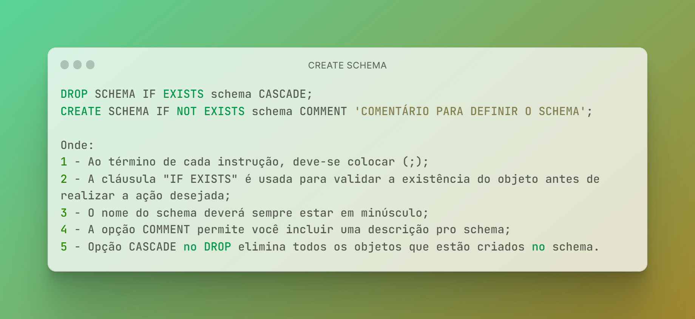
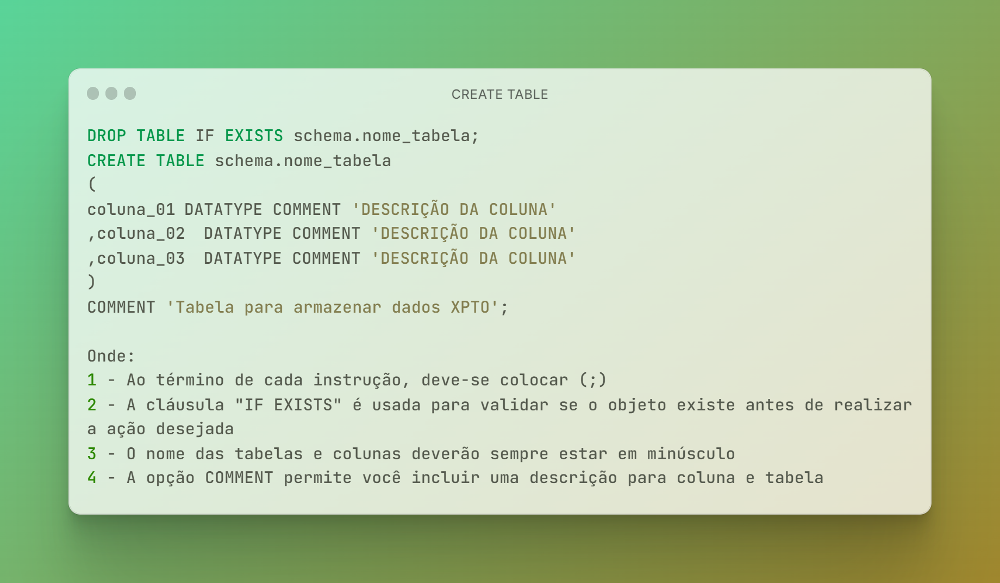

# Projeto BI Zero TO DW

## 4 - Configurando o Ambiente Databricks

É nessa etapa que é realizada a configuração do ambiente Databricks para ingestão dos dados.

São elas:

|Sequência|Ação|Detalhamento
|---|---|---|
|SEQ-4.1|Configuração do ambiente no Databricks|Criação do storage "dbfs:/FileStore/tables/landing_zone"|
|SEQ-4.2 / SEQ-4.3 / SEQ-4.4|Criação de Schemas (Bancos de Dados)|Criação das Camadas Bronze, Silver e Gold |
|SEQ-4.5 / SEQ-4.6 / SEQ-4.7|Criação das Tabelas|Criação das Tabelas das Camadas Bronze, Silver e Gold|
|SEQ-4.8|Criação Script Dimensão Tempo|Geração de Scripts de Insert para a Dimensão Tempo para o mês de Jul/2023|
|SEQ-4.9|Visualizando a Estrutura de uma tabela|Identificando informações de nome da coluna, datatype, nulabilidade, descrição das colunas|
|SEQ-4.10|Visualizando informçoes de armazenamento de uma tabela|Idenficação de quando a tabela foi criada, onde ela é armazenada etc.|
|SEQ-4.11|Visualizando a Estrutura de uma schema|Informações do Schema|

O arquivo do Notebook é encontrado aqui. [Notebook Configuração Ambiente Databricks](https://github.com/dbaassists/Projeto_BI_Zero_TO_DW/blob/main/02_NOTEBOOK/00_configuracao_ambiente.ipynb)

### SEQ-4.1 - Criação Camada Landing Zone

Nessa etapa que é realizada a criação de uma área no HDFS do Databricks para salvar em formato parquet os dados exportados do Azure SQL Database.

Nome do Diretório: dbfs:/FileStore/tables/landing_zone

```
diretorio_landing_zone = "dbfs:/FileStore/tables/landing_zone"

try:
    dbutils.fs.ls(diretorio_landing_zone)
    dbutils.fs.rm(diretorio_landing_zone, True)
        
except:

    print(f"O diretório {diretorio_landing_zone} não existe.")

```


```
try:

    dbutils.fs.ls(diretorio_landing_zone)
        
except:

    print(f"O diretório {diretorio_landing_zone} não existe e será criado.")
    dbutils.fs.mkdirs(diretorio_landing_zone)
```
### SEQ-4.2 - Criação Schema de Dados "bronze"

Criação do Schema de Dados "bronze" para armazenamento dos dados ingeridos a partir da leituda dos arquivos de dados exportados do Azure SQL Database.

Trata-se de uma camada transiente, ou seja, é o momento em que os dados são carregados em sua totalidade sem a aplicação de tratamentos. 

Gosto de definir essa etapa como a transposição dos arquivos em tabelas, usando o mesmo nome para criar as tabelas e colunas. 

Nenhum tratamento é aplicado sobre os dados.

As tabelas são TRUNCADAS (limpas) sempre a cada ciclo de carga.

A sintaxe do script de criação de um Schema.




```
%sql
DROP SCHEMA IF EXISTS bronze CASCADE;
CREATE SCHEMA IF NOT EXISTS bronze COMMENT 'SCHEMA (Banco de Dados) referente a Camada BRONZE.';
```

### SEQ-4.3 - Criação Schema de Dados "silver"

Criação do Schema de Dados "silver" para armazenamento dos dados ingeridos da camada bronze.

Nessa camada os dados sofreram transformações (aplicações de regras de negócio) e estarão disponíveis para que seja criada a camada dimensional.

```
%sql
DROP SCHEMA IF EXISTS silver CASCADE;
CREATE SCHEMA IF NOT EXISTS silver COMMENT 'SCHEMA (Banco de Dados) referente a Camada SILVER.';
```

### SEQ-4.4 - Criação Schema de Dados "gold"

Criação do Schema de Dados "gold" para armazenamento dos dados após a ingestão dos dados na camada silver.

Nessa camada os objetos serão modelados como dimensões e fatos.

```
%sql
DROP SCHEMA IF EXISTS gold CASCADE;
CREATE SCHEMA IF NOT EXISTS gold COMMENT 'SCHEMA (Banco de Dados) referente a Camada GOLD.';
```

[Documentação Create Schema Databricks](https://learn.microsoft.com/en-us/azure/databricks/sql/language-manual/sql-ref-syntax-ddl-create-schema)

### SEQ-4.5 - CREATE TABLE schema "bronze" 

Criação das tabelas no Schema de Dados "bronze" com a mesma estrutura dos arquivos.

Nessa etapa, as tabelas serão criadas as tabelas no Schema bronze.

A sintaxe do script é muito parecida com que possuímos em bancos de dados.



```
%sql

DROP  TABLE IF EXISTS bronze.TB_FORMA_PAGAMENTO;
CREATE TABLE bronze.TB_FORMA_PAGAMENTO
(
CODIGO_FORMA_PAGAMENTO	 INT COMMENT 'Código da Forma de Pagamento na Tabela TB_FORMA_PAGAMENTO.'
,DESCRICAO_FORMA_PAGAMENTO VARCHAR(100) COMMENT 'Descrição da Forma de Pagamento na Tabela TB_FORMA_PAGAMENTO.'
)
COMMENT 'Armazena informações de forma de pagamento.';

DROP  TABLE IF EXISTS bronze.TB_CATEGORIA_PRODUTO;
CREATE TABLE bronze.TB_CATEGORIA_PRODUTO
(
CODIGO_CATEGORIA INT COMMENT 'Código da Categoria do Produto.'
,DECRICAO_CATEGORIA VARCHAR(100) COMMENT 'Descrição da Categoria do Produto.'
)
COMMENT 'Armazena informações das categorias dos produtos';

DROP  TABLE IF EXISTS bronze.TB_PRODUTO;
CREATE TABLE bronze.TB_PRODUTO
(
CODIGO_PRODUTO	 INT  COMMENT 'Código do Produto.'
,DESCRICAO_PRODUTO	 VARCHAR(100) COMMENT 'Descrição do Produto.'
,CODIGO_CATEGORIA INT COMMENT 'Categoria do Produto.'
)
COMMENT '	Armazena informações de produtos.';

DROP  TABLE IF EXISTS bronze.TB_CLIENTE;
CREATE TABLE bronze.TB_CLIENTE
(
CODIGO_CLIENTE INT COMMENT 'Código do Cliente.'
,NOME_CLIENTE VARCHAR(100) COMMENT 'Nome do Cliente.'
)
COMMENT 'Armazena informações de clientes.';

DROP  TABLE IF EXISTS bronze.TB_VENDEDOR;
CREATE TABLE bronze.TB_VENDEDOR
(
CODIGO_VENDEDOR INT COMMENT 'Código do Vendedor.'
,NOME_VENDEDOR VARCHAR(100) COMMENT 'Nome do Vendedor.'
)
COMMENT 'Armazena informações de vendedores.';

DROP  TABLE IF EXISTS bronze.TB_LOJA;
CREATE TABLE bronze.TB_LOJA
(
CODIGO_LOJA	 INT COMMENT 'Código da Loja.'
,NOME_LOJA	 VARCHAR(100) COMMENT 'Nome da Loja.'
,LOCALIDADE_LOJA	 VARCHAR(100) COMMENT 'Localidade da Loja.'
,TIPO_LOJA VARCHAR(100) COMMENT 'Tipo da Loja.'
)
COMMENT 'Armazena informações de lojas.';

DROP  TABLE IF EXISTS bronze.TB_VENDA;
CREATE TABLE bronze.TB_VENDA
(
CODIGO_VENDA INT COMMENT 'Código da Venda.'
,DATA_VENDA	TIMESTAMP COMMENT 'Data da Venda'
,CODIGO_CLIENTE	INT COMMENT 'Código do Cliente.'
,CODIGO_VENDEDOR	INT COMMENT 'Código do Vendedor.'
,CODIGO_LOJA	INT COMMENT 'Código da Loja.'
,VALOR_FINAL DECIMAL(18,2)	 COMMENT 'Valor Total da Venda.'
,FORMA_PAGAMENTO	INT COMMENT 'Forma de Pagamento.'
,TIPO_PAGAMENTO VARCHAR(100) COMMENT 'Tipo de Pagamento.'
)
COMMENT 'Armazenada informações de vendas.';

DROP  TABLE IF EXISTS bronze.TB_ITEM_VENDA;
CREATE TABLE bronze.TB_ITEM_VENDA
(
CODIGO_VENDA INT COMMENT 'Código da Venda.'
,CODIGO_PRODUTO	INT COMMENT 'Código do Produto.'
,VALOR_UNITARIO DECIMAL(18,2)	 COMMENT 'Valor Unitário do Produto.'
,QUANTIDADE	INT COMMENT 'Quantidade do Produto Vendido.'
,VALOR_FINAL DECIMAL(18,2) COMMENT 'Valor Final do Produto Vendido.'
)
COMMENT 'Armazena informações sobre os itens que foram vendidos.';
```

### SEQ-4.6 - CREATE TABLE schema "silver"

Criação das tabelas no Schema de Dados "silver".

```
%sql

DROP  TABLE IF EXISTS silver.TB_FORMA_PAGAMENTO;
CREATE TABLE silver.TB_FORMA_PAGAMENTO
(
CODIGO_FORMA_PAGAMENTO	 INT COMMENT 'Código da Forma de Pagamento na Tabela TB_FORMA_PAGAMENTO.'
,DESCRICAO_FORMA_PAGAMENTO VARCHAR(100) COMMENT 'Descrição da Forma de Pagamento na Tabela TB_FORMA_PAGAMENTO.'
,DATA_CADASTRO TIMESTAMP COMMENT 'Data de Cadastro do Registro.'
,DATA_ALTERACAO TIMESTAMP COMMENT 'Data de Atualização do Registro.'
)
COMMENT 'Armazena informações de forma de pagamento.';

DROP  TABLE IF EXISTS silver.TB_CATEGORIA_PRODUTO;
CREATE TABLE silver.TB_CATEGORIA_PRODUTO
(
CODIGO_CATEGORIA INT COMMENT 'Código da Categoria do Produto.'
,DECRICAO_CATEGORIA VARCHAR(100) COMMENT 'Descrição da Categoria do Produto.'
,DATA_CADASTRO TIMESTAMP COMMENT 'Data de Cadastro do Registro.'
,DATA_ALTERACAO TIMESTAMP COMMENT 'Data de Atualização do Registro.'
)
COMMENT 'Armazena informações das categorias dos produtos';

DROP  TABLE IF EXISTS silver.TB_PRODUTO;
CREATE TABLE silver.TB_PRODUTO
(
CODIGO_PRODUTO	 INT  COMMENT 'Código do Produto.'
,DESCRICAO_PRODUTO	 VARCHAR(100) COMMENT 'Descrição do Produto.'
,CODIGO_CATEGORIA INT COMMENT 'Categoria do Produto.'
,DATA_CADASTRO TIMESTAMP COMMENT 'Data de Cadastro do Registro.'
,DATA_ALTERACAO TIMESTAMP COMMENT 'Data de Atualização do Registro.'
)
COMMENT '	Armazena informações de produtos.';

DROP  TABLE IF EXISTS silver.TB_CLIENTE;
CREATE TABLE silver.TB_CLIENTE
(
CODIGO_CLIENTE INT COMMENT 'Código do Cliente.'
,NOME_CLIENTE VARCHAR(100) COMMENT 'Nome do Cliente.'
,DATA_CADASTRO TIMESTAMP COMMENT 'Data de Cadastro do Registro.'
,DATA_ALTERACAO TIMESTAMP COMMENT 'Data de Atualização do Registro.'
)
COMMENT 'Armazena informações de clientes.';

DROP  TABLE IF EXISTS silver.TB_VENDEDOR;
CREATE TABLE silver.TB_VENDEDOR
(
CODIGO_VENDEDOR INT COMMENT 'Código do Vendedor.'
,NOME_VENDEDOR VARCHAR(100) COMMENT 'Nome do Vendedor.'
,DATA_CADASTRO TIMESTAMP COMMENT 'Data de Cadastro do Registro.'
,DATA_ALTERACAO TIMESTAMP COMMENT 'Data de Atualização do Registro.'
)
COMMENT 'Armazena informações de vendedores.';

DROP  TABLE IF EXISTS silver.TB_LOJA;
CREATE TABLE silver.TB_LOJA
(
CODIGO_LOJA	 INT COMMENT 'Código da Loja.'
,NOME_LOJA	 VARCHAR(100) COMMENT 'Nome da Loja.'
,LOCALIDADE_LOJA	 VARCHAR(100) COMMENT 'Localidade da Loja.'
,TIPO_LOJA VARCHAR(100) COMMENT 'Tipo da Loja.'
,DATA_CADASTRO TIMESTAMP COMMENT 'Data de Cadastro do Registro.'
,DATA_ALTERACAO TIMESTAMP COMMENT 'Data de Atualização do Registro.'
)
COMMENT 'Armazena informações de lojas.';

DROP  TABLE IF EXISTS silver.TB_VENDA;
CREATE TABLE silver.TB_VENDA
(
CODIGO_VENDA INT COMMENT 'Código da Venda.'
,DATA_VENDA	TIMESTAMP COMMENT 'Data da Venda'
,CODIGO_CLIENTE	INT COMMENT 'Código do Cliente.'
,CODIGO_VENDEDOR	INT COMMENT 'Código do Vendedor.'
,CODIGO_LOJA	INT COMMENT 'Código da Loja.'
,VALOR_FINAL DECIMAL(18,2)	 COMMENT 'Valor Total da Venda.'
,FORMA_PAGAMENTO	INT COMMENT 'Forma de Pagamento.'
,TIPO_PAGAMENTO VARCHAR(100) COMMENT 'Tipo de Pagamento.'
,DATA_CADASTRO TIMESTAMP COMMENT 'Data de Cadastro do Registro.'
,DATA_ALTERACAO TIMESTAMP COMMENT 'Data de Atualização do Registro.'
)
COMMENT 'Armazenada informações de vendas.';

DROP  TABLE IF EXISTS silver.TB_ITEM_VENDA;
CREATE TABLE silver.TB_ITEM_VENDA
(
CODIGO_VENDA INT COMMENT 'Código da Venda.'
,CODIGO_PRODUTO	INT COMMENT 'Código do Produto.'
,VALOR_UNITARIO DECIMAL(18,2)	 COMMENT 'Valor Unitário do Produto.'
,QUANTIDADE	INT COMMENT 'Quantidade do Produto Vendido.'
,VALOR_FINAL DECIMAL(18,2) COMMENT 'Valor Final do Produto Vendido.'
,DATA_CADASTRO TIMESTAMP COMMENT 'Data de Cadastro do Registro.'
,DATA_ALTERACAO TIMESTAMP COMMENT 'Data de Atualização do Registro.'
)
COMMENT 'Armazena informações sobre os itens que foram vendidos.';
```

### SEQ-4.7 - CREATE TABLE schema "gold"

Criação das tabelas no Schema de Dados "gold".

```
%sql

DROP  TABLE IF EXISTS gold.DIM_FORMA_PAGAMENTO;
CREATE TABLE gold.DIM_FORMA_PAGAMENTO
(
ID_FORMA_PAGAMENTO VARCHAR(100) COMMENT 'Chave da Dimensão Forma de Pagamento.'
,CODIGO_FORMA_PAGAMENTO	 INT COMMENT 'Código da Forma de Pagamento na Tabela TB_FORMA_PAGAMENTO.'
,DESCRICAO_FORMA_PAGAMENTO VARCHAR(100) COMMENT 'Descrição da Forma de Pagamento na Tabela TB_FORMA_PAGAMENTO.'
,DATA_CADASTRO TIMESTAMP COMMENT 'Data de Cadastro do Registro.'
,DATA_ALTERACAO TIMESTAMP COMMENT 'Data de Atualização do Registro.'
);

DROP  TABLE IF EXISTS gold.DIM_CATEGORIA_PRODUTO;
CREATE TABLE gold.DIM_CATEGORIA_PRODUTO
(
ID_CATEGORIA_PRODUTO VARCHAR(100) COMMENT 'Chave da Dimensão Categoria do Produto.'
,CODIGO_CATEGORIA INT COMMENT 'Código da Categoria do Produto.'
,DECRICAO_CATEGORIA VARCHAR(100) COMMENT 'Descrição da Categoria do Produto.'
,DATA_CADASTRO TIMESTAMP COMMENT 'Data de Cadastro do Registro.'
,DATA_ALTERACAO TIMESTAMP COMMENT 'Data de Atualização do Registro.'
);

DROP  TABLE IF EXISTS gold.DIM_PRODUTO;
CREATE TABLE gold.DIM_PRODUTO
(
ID_PRODUTO VARCHAR(100) COMMENT 'Chave da Dimensão Produto.'
,CODIGO_PRODUTO	 INT  COMMENT 'Código do Produto.'
,DESCRICAO_PRODUTO	 VARCHAR(100) COMMENT 'Descrição do Produto.'
,CODIGO_CATEGORIA INT COMMENT 'Categoria do Produto.'
,DATA_CADASTRO TIMESTAMP COMMENT 'Data de Cadastro do Registro.'
,DATA_ALTERACAO TIMESTAMP COMMENT 'Data de Atualização do Registro.'
);

DROP  TABLE IF EXISTS gold.DIM_CLIENTE;
CREATE TABLE gold.DIM_CLIENTE
(
ID_CLIENTE VARCHAR(100) COMMENT 'Chave da Dimensão Cliente.'
,CODIGO_CLIENTE INT COMMENT 'Código do Cliente.'
,NOME_CLIENTE VARCHAR(100) COMMENT 'Nome do Cliente.'
,DATA_CADASTRO TIMESTAMP COMMENT 'Data de Cadastro do Registro.'
,DATA_ALTERACAO TIMESTAMP COMMENT 'Data de Atualização do Registro.'
);

DROP  TABLE IF EXISTS gold.DIM_VENDEDOR;
CREATE TABLE gold.DIM_VENDEDOR
(
ID_VENDEDOR VARCHAR(100) COMMENT 'Chave da Dimensão Vendedor.'
,CODIGO_VENDEDOR INT COMMENT 'Código do Vendedor.'
,NOME_VENDEDOR VARCHAR(100) COMMENT 'Nome do Vendedor.'
,DATA_CADASTRO TIMESTAMP COMMENT 'Data de Cadastro do Registro.'
,DATA_ALTERACAO TIMESTAMP COMMENT 'Data de Atualização do Registro.'
);

DROP  TABLE IF EXISTS gold.DIM_LOJA;
CREATE TABLE gold.DIM_LOJA
(
ID_LOJA VARCHAR(100) COMMENT 'Chave da Dimensão Loja.'
,CODIGO_LOJA	 INT COMMENT 'Código da Loja.'
,NOME_LOJA	 VARCHAR(100) COMMENT 'Nome da Loja.'
,LOCALIDADE_LOJA	 VARCHAR(100) COMMENT 'Localidade da Loja.'
,TIPO_LOJA VARCHAR(100) COMMENT 'Tipo da Loja.'
,DATA_CADASTRO TIMESTAMP COMMENT 'Data de Cadastro do Registro.'
,DATA_ALTERACAO TIMESTAMP COMMENT 'Data de Atualização do Registro.'
);

DROP  TABLE IF EXISTS gold.FATO_VENDA;
CREATE TABLE gold.FATO_VENDA
(
ID_TEMPO VARCHAR(100)  COMMENT 'Chave da Dimensão Tempo.'
,ID_CLIENTE	VARCHAR(100)  COMMENT 'Chave da Dimensão Cliente.'
,ID_VENDEDOR VARCHAR(100) COMMENT 'Chave da Dimensão Vendedor.'
,ID_LOJA VARCHAR(100) COMMENT 'Chave da Dimensão Loja.'
,ID_FORMA_PAGAMENTO	 VARCHAR(100) COMMENT 'Chave da Dimensão Forma de Pagamento.'
,ID_PRODUTO	VARCHAR(100)  COMMENT 'Chave da Dimensão Produto.'
,ID_CATEGORIA_PRODUTO VARCHAR(100) COMMENT 'Chave da Dimensão Categoria do Produto.'
,CODIGO_VENDA INT COMMENT 'Código da Venda.'
,QUANTIDADE	INT COMMENT 'Quantidade vendida do produto.'
,VALOR_UNITARIO DECIMAL(18,2)	 COMMENT 'Valor unitário do produto.'
,TIPO_PAGAMENTO VARCHAR(100) COMMENT 'Tipo de Pagamentto da Venda.'
,DATA_CADASTRO TIMESTAMP COMMENT 'Data de Cadastro do Registro.'
,DATA_ALTERACAO TIMESTAMP COMMENT 'Data de Atualização do Registro.'
);

DROP  TABLE IF EXISTS gold.DIM_TEMPO;
CREATE TABLE gold.DIM_TEMPO
(
ID_TEMPO VARCHAR(100) COMMENT 'Chave da Dimensão Tempo.'
,DATA TIMESTAMP COMMENT 'Data.'
,ANO INT COMMENT 'Ano referente a coluna data.'
,MES	INT COMMENT 'Mês referente a coluna data.'
,DIA INT COMMENT 'Dia referente a coluna data.' 
,DATA_CADASTRO TIMESTAMP COMMENT 'Data de Cadastro do Registro.'
,DATA_ALTERACAO TIMESTAMP COMMENT 'Data de Atualização do Registro.'
);
```

### SEQ-4.8 - Inserção Dimensão Tempo

Script para inserção dos dados na Dimensão Tempo.

```
%sql
INSERT INTO gold.DIM_TEMPO (ID_TEMPO,DATA,ANO,MES,DIA) VALUES ('20230701','2023-07-01', 2023, 7, 1);
INSERT INTO gold.DIM_TEMPO (ID_TEMPO,DATA,ANO,MES,DIA) VALUES ('20230702','2023-07-02', 2023, 7, 2);
INSERT INTO gold.DIM_TEMPO (ID_TEMPO,DATA,ANO,MES,DIA) VALUES ('20230703','2023-07-03', 2023, 7, 3);
INSERT INTO gold.DIM_TEMPO (ID_TEMPO,DATA,ANO,MES,DIA) VALUES ('20230704','2023-07-04', 2023, 7, 4);
INSERT INTO gold.DIM_TEMPO (ID_TEMPO,DATA,ANO,MES,DIA) VALUES ('20230705','2023-07-05', 2023, 7, 5);
INSERT INTO gold.DIM_TEMPO (ID_TEMPO,DATA,ANO,MES,DIA) VALUES ('20230706','2023-07-06', 2023, 7, 6);
INSERT INTO gold.DIM_TEMPO (ID_TEMPO,DATA,ANO,MES,DIA) VALUES ('20230707','2023-07-07', 2023, 7, 7);
INSERT INTO gold.DIM_TEMPO (ID_TEMPO,DATA,ANO,MES,DIA) VALUES ('20230708','2023-07-08', 2023, 7, 8);
INSERT INTO gold.DIM_TEMPO (ID_TEMPO,DATA,ANO,MES,DIA) VALUES ('20230709','2023-07-09', 2023, 7, 9);
INSERT INTO gold.DIM_TEMPO (ID_TEMPO,DATA,ANO,MES,DIA) VALUES ('20230710','2023-07-10', 2023, 7, 10);
INSERT INTO gold.DIM_TEMPO (ID_TEMPO,DATA,ANO,MES,DIA) VALUES ('20230711','2023-07-11', 2023, 7, 11);
INSERT INTO gold.DIM_TEMPO (ID_TEMPO,DATA,ANO,MES,DIA) VALUES ('20230712','2023-07-12', 2023, 7, 12);
INSERT INTO gold.DIM_TEMPO (ID_TEMPO,DATA,ANO,MES,DIA) VALUES ('20230713','2023-07-13', 2023, 7, 13);
INSERT INTO gold.DIM_TEMPO (ID_TEMPO,DATA,ANO,MES,DIA) VALUES ('20230714','2023-07-14', 2023, 7, 14);
INSERT INTO gold.DIM_TEMPO (ID_TEMPO,DATA,ANO,MES,DIA) VALUES ('20230715','2023-07-15', 2023, 7, 15);
INSERT INTO gold.DIM_TEMPO (ID_TEMPO,DATA,ANO,MES,DIA) VALUES ('20230716','2023-07-16', 2023, 7, 16);
INSERT INTO gold.DIM_TEMPO (ID_TEMPO,DATA,ANO,MES,DIA) VALUES ('20230717','2023-07-17', 2023, 7, 17);
INSERT INTO gold.DIM_TEMPO (ID_TEMPO,DATA,ANO,MES,DIA) VALUES ('20230718','2023-07-18', 2023, 7, 18);
INSERT INTO gold.DIM_TEMPO (ID_TEMPO,DATA,ANO,MES,DIA) VALUES ('20230719','2023-07-19', 2023, 7, 19);
INSERT INTO gold.DIM_TEMPO (ID_TEMPO,DATA,ANO,MES,DIA) VALUES ('20230720','2023-07-20', 2023, 7, 20);
INSERT INTO gold.DIM_TEMPO (ID_TEMPO,DATA,ANO,MES,DIA) VALUES ('20230721','2023-07-21', 2023, 7, 21);
INSERT INTO gold.DIM_TEMPO (ID_TEMPO,DATA,ANO,MES,DIA) VALUES ('20230722','2023-07-22', 2023, 7, 22);
INSERT INTO gold.DIM_TEMPO (ID_TEMPO,DATA,ANO,MES,DIA) VALUES ('20230723','2023-07-23', 2023, 7, 23);
INSERT INTO gold.DIM_TEMPO (ID_TEMPO,DATA,ANO,MES,DIA) VALUES ('20230724','2023-07-24', 2023, 7, 24);
INSERT INTO gold.DIM_TEMPO (ID_TEMPO,DATA,ANO,MES,DIA) VALUES ('20230725','2023-07-25', 2023, 7, 25);
INSERT INTO gold.DIM_TEMPO (ID_TEMPO,DATA,ANO,MES,DIA) VALUES ('20230726','2023-07-26', 2023, 7, 26);
INSERT INTO gold.DIM_TEMPO (ID_TEMPO,DATA,ANO,MES,DIA) VALUES ('20230727','2023-07-27', 2023, 7, 27);
INSERT INTO gold.DIM_TEMPO (ID_TEMPO,DATA,ANO,MES,DIA) VALUES ('20230728','2023-07-28', 2023, 7, 28);
INSERT INTO gold.DIM_TEMPO (ID_TEMPO,DATA,ANO,MES,DIA) VALUES ('20230729','2023-07-29', 2023, 7, 29);
INSERT INTO gold.DIM_TEMPO (ID_TEMPO,DATA,ANO,MES,DIA) VALUES ('20230730','2023-07-30', 2023, 7, 30);
INSERT INTO gold.DIM_TEMPO (ID_TEMPO,DATA,ANO,MES,DIA) VALUES ('20230731','2023-07-31', 2023, 7, 31);
```

### SEQ-4.9 - Visualizar Estrutura de Tabela

Script para visualizar a estrutura de uma tabela qualquer.

```
%sql
DESC gold.DIM_LOJA
```

### SEQ-4.10 - Visualizar Armazenamento de uma Tabela

Script para visualizar informações de armazenamento de uma tabela qualquer.

```
%sql
DESC DETAIL gold.DIM_LOJA
```

### SEQ-4.11 - Visualizar Estrutura de Schema

Script para visualizar a estrutura de um schema.

```
%sql
DESC SCHEMA bronze
```