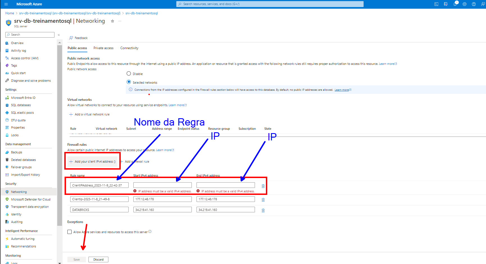

# Projeto BI Zero TO DW

## 5 - Ingestão dos Dados do Azure SQL Databse

Pré-Requisito para ingestão dos dados do Azure SQL Database.

|Sequência|Ação|Detalhamento
|---|---|---|
|SEQ-2.1|Provisionamento do Azure SQL|Provisionamento de um banco de dados no Azure|
|SEQ-2.2|Configuração do Ambiente Azure|Criação de toda a estrutura de tabelas e dados|

Atividades que serão realizadas nessa etapa.

|Sequência|Ação|Detalhamento
|---|---|---|
|SEQ-01 / SEQ-02|Configuração de Biblioteca|Instalação da Biblioteca "sqlalchemy"|
|SEQ-03|Consumindo Arquivo JSON|Arquivo com as credenciais de acesso ao Azure SQL Database|
|SEQ-04|Selação das Tabelas|Identificar quais serão as tabelas usadas durante o processo de ingestão|
|SEQ-05|Extração dos Dados do Azure SQL|Coleta dos Dados do Azure SQL|
|SEQ-06|Persistir os Dados em Parquet|Os dados deverão ser persistidos no diretório de cada tabela em formato parquet.|

O arquivo do Notebook é encontrado aqui. [Notebook Ingestão Dados Azure SQL Database](https://github.com/dbaassists/Projeto_BI_Zero_TO_DW/blob/main/02_NOTEBOOK/01_ingestao_dados_azure_sql.ipynb)


### SEQ-5.1 - Configurando Bibliotaca sqlalchemy

A biblioteca "sqlalchemy" será usada para realizar a conexão com o Azure SQL Database.

```
pip install sqlalchemy
```

### SEQ-5.2 - Importando das bibliotecas

Seleção e Importação das bibliotecas que serão usadas

Validar se existe a necessidade de importar todas as bibliotecas.

```
from sqlalchemy import __version__ as sa_version, create_engine, text
import json
import pandas as pd
```

### SEQ-5.3 - Arquivo Parâmetro de Conexão com Database

Importação do Arquivo JSON que será usado para buscar informações de conexão com o Azure SQL Database

Esse arquivo JSON terá a seguinte estrutura.


O arquivo será lido e as informações de servidor, banco de dados, usuário e senha serão armazenado nas variáveis.

Esse modo de trabalhar é melhor pois você não expõem as suas senhas e mantém um único ponto de alteração.

No Azure você pode armazenar suas credenciais no Azure Key Vault.

```
dfjson =  pd.read_json("https://raw.githubusercontent.com/dbaassists/Projeto_BI_Zero_TO_DW/main/04_ARQUIVO_CONFIG/config_azure_sql.json")

server = dfjson['Config']['server']
database = dfjson['Config']['database']
username = dfjson['Config']['username']
password = dfjson['Config']['password']
```

### SEQ-5.4 - Extração Dados Azure SQL Database

Identificação das Tabelas do Azure SQL Database que serão extraídas.

Obs: Para esse nosso projeto, estaremos importando todas as tabelas do banco.

```
df = spark.read \
.format("jdbc") \
.option("url", f"jdbc:sqlserver://{server};database={database}") \
.option("query", """SELECT s.name + '.' +  t.NAME AS Nome_Tabela 
                        FROM sys.tables t
                        INNER JOIN sys.schemas s
                        ON t.schema_id = s.schema_id""") \
.option("user", f"{username}") \
.option("password", f"{password}") \
.load()
```

Visualizando o conteúdo retornado da execução da consulta.

```
display(df)
```

### SEQ-5.5 - Extração de Dados

Após a extração dos dados do Azure SQL Database, os dados serão persistidos na camada landing zone em formato parquet.

Comentando um pouco o script abaixo:

- No fluxo abaixo, nosso processamento irá trabalhar em loop uma vez que já identificou os objetos que precisam ser extraidos no passo "SEQ-5.4" e agora irá realizar a consulta de todos eles e por último estará salvando os dados no diretório "dbfs:/FileStore/tables/landing_zone/" em formato parquet.

```
lista_tabelas = df.collect()

for tabela in lista_tabelas:

    tabela_paquet = tabela['Nome_Tabela'].replace('dbo.','').lower()

    print(tabela_paquet)

    diretorio_parquet = "dbfs:/FileStore/tables/landing_zone/{0}".format(tabela_paquet)

    df = (spark.read
    .format("jdbc")
    .option("url", f"jdbc:sqlserver://{server};database={database}") \
    .option("query", "SELECT * FROM {0}".format(tabela['Nome_Tabela']))
    .option("user", f"{username}") \
    .option("password", f"{password}") \
    .load()
    )
    
    (df.write
    .format('parquet')
    .mode("overwrite")
    .save(diretorio_parquet)
    )
```

### SEQ-5.6 - Firewall Azure SQL Database - Liberando acesso ao Banco

```
exec sp_set_firewall_rule N'nome_regra', '0.0.0.0', '0.0.0.0'
```

Ou podemos fazer a liberação acessando o portal do Azure.


Depois realizamos o cadastro da regra.



### SEQ-5.7 - Firewall Azure SQL Database - Revogando acesso ao Banco

```
exec sp_delete_firewall_rule N'nome_regra'
```

Ou podemos fazer a revogação acessando o portal do Azure.


Depois realizamos a entrada referente a regra.

